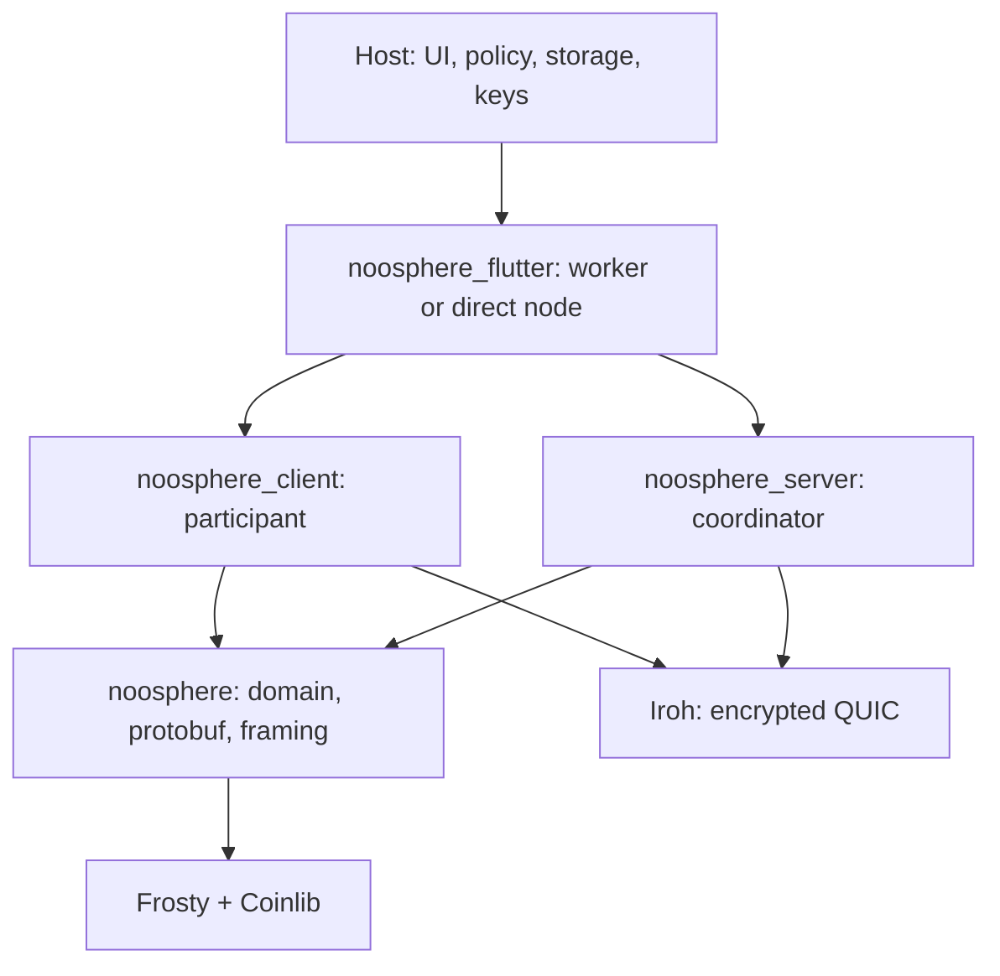

# Noosphere architecture

Noosphere coordinates a peer group around shared threshold keys. Participants
jointly create a FROST key, then a threshold of them produces Schnorr signatures
through ROAST without assembling the complete private key during ordinary
signing. Requests can cover transactions, messages or batches of digests.

The coordinator authenticates participants, orders state changes, routes typed
events and collects contributions. It does not hold a participant's FROST share
and cannot sign alone. Participants independently verify proposals, protocol
inputs and final signatures.

The host application owns identity presentation, user consent, key custody,
durable storage and the meaning of signed data. Noosphere owns the protocol
state machines and specifies which mutations must be stored atomically. It is
therefore neither a wallet database nor a stateless signing utility.

## System at a glance

A typical deployment runs Flutter participants against a durable standalone
coordinator. An application can also embed either or both roles. When a signer
targets a matching coordinator in the same process, `LocalCoordinatorApi`
bypasses protobuf and QUIC but preserves login, sessions, events and the
server's per-group ordering. Remote participants continue to use Iroh.

`NoosphereWorker` keeps protocol objects and synchronous cryptography in one
long-lived isolate; providers and UI state stay on the host isolate. This is a
scheduling/ownership boundary, not an OS security boundary. `NoosphereNode`
runs the same roles directly in its caller's isolate.

| Capability | Status |
| --- | --- |
| FROST DKG and ROAST signing | Implemented |
| Transaction and text-message signing metadata | Implemented |
| Invite-based room enrollment | Implemented through direct server/client APIs |
| Single-signer coordinator switching helper | Implemented; not a group vote |
| Membership-transition values | Implemented; end-to-end orchestration is proposed |
| Negotiated protocol extensions | Proposed, not implemented |

## From connection to signature

1. The host supplies a trusted roster, participant identity-key access,
   coordinator pin and persistence providers.
2. A remote participant connects to the pinned Iroh endpoint; a co-located
   participant may use the matching in-process coordinator API.
3. The participant signs a fresh challenge, binding its roster identity and
   group to a logical session.
4. Session startup returns a snapshot, followed by typed protocol events.
   Ordinary participant operations use independent RPCs.
5. A participant proposes DKG or signing. Other participants verify and
   approve or reject through their applications.
6. DKG or ROAST advances only after required durable writes. Final signatures
   are verified before exposure to the host.
7. The host stores application history and performs external effects such as
   transaction broadcast.

## Trust and data boundaries

| Boundary | Rule |
| --- | --- |
| Coordinator transport | Remote clients pin its Iroh endpoint identity |
| Participant identity | A separate secp256k1 roster key signs login and protocol objects |
| Threshold authority | FROST shares come from DKG; the coordinator has none |
| Event authorship | Transport proves coordinator delivery; inner signatures prove participant content |
| Application policy | Receiving an event never implies consent or business validity |
| Persistence | Host providers implement the atomic operations required by the state machines |

The coordinator remains trusted for availability and routing: it can omit,
delay, replay or selectively deliver events. It cannot silently alter signed
participant content or produce a threshold signature without enough shares.

Three serialization layers stay separate:

| Layer | Representation |
| --- | --- |
| Network | Operation-prefixed protobuf RPC streams; length-prefixed persistent events |
| Signed domain values | Canonical binary encodings nested where signatures require them |
| Flutter host/worker | Same-build Dart envelopes and public DTOs over isolate ports |

Protobuf parsing establishes structure, not authorization. Iroh encrypts remote
transport, not data from the coordinator endpoint. Recipient-specific DKG and
recovery shares add their own encryption.

## Events, restart and extensions

Typed domain `Event`s are protocol inputs: proposals, contributions, ROAST
rounds, progress and results. They are converted to protobuf for remote Iroh
delivery, then validated by the participant state machine. `ClientEvent` and
worker events are later local projections, not wire messages or durable logs.

The host stores client keys/nonces, coordinator snapshots and rooms through
explicit interfaces. Restart creates new sessions. Completed results and
recovery shares can be redelivered; unfinished DKG becomes interrupted and
unfinished signing becomes blocked. Prepared client operations remain evidence
of a possibly sent mutation, preventing blind retry and FROST nonce reuse.

Generic text can be threshold-signed through typed message metadata, but the
protocol has no arbitrary event bus. A negotiated extension envelope is
proposed for optional application features; it is not implemented. Core DKG,
ROAST, recovery and authorization remain coordinated protocol changes.

## Detailed guide

| Chapter | Focus |
| --- | --- |
| [Packages](architecture/packages.md) | Dependencies, entry points and source ownership |
| [Identities](architecture/mnemonic-and-identity.md) | BIP-39 branches and independent FROST shares |
| [Data models](architecture/data-models.md) | Canonical values, ownership and durable/public records |
| [Persistence](architecture/state-and-persistence.md) | Atomic signing preparation and crash recovery |
| [Protobuf](architecture/protobuf-and-framing.md) | RPC and persistent-stream framing |
| [Iroh](architecture/iroh-transport.md) | Pinning, authentication, streams, limits and reconnect |
| [Client](architecture/client.md) | Participant login, DKG, signing and recovery |
| [Server](architecture/server.md) | Group dispatch, coordination and persistence |
| [Events](architecture/events.md) | Meaning, trust, wire mapping, projections and delivery |
| [Generic data](architecture/generic-data.md) | Text, JSON, digests and the extension boundary |
| [Extensions](architecture/protocol-extensions.md) | Proposed negotiation, registry and delivery design |
| [Flutter](architecture/flutter-and-isolates.md) | Direct nodes, workers, providers and shutdown |
| [Rooms](architecture/rooms-and-transitions.md) | Enrollment, coordinator changes and successor groups |
| [Development](architecture/development-and-testing.md) | Configuration, hosts, platforms and verification |
