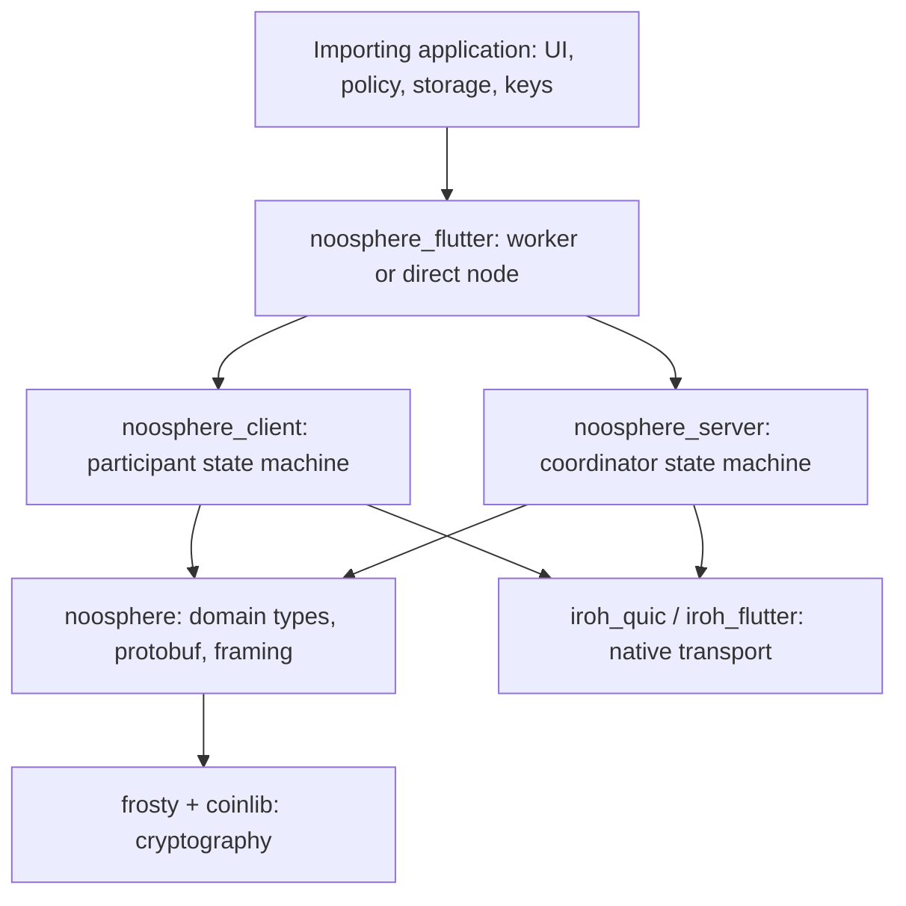

# Noosphere architecture

Noosphere is a Dart implementation of a coordinated threshold-signing protocol,
with a Flutter adapter for running participants and an optional embedded
coordinator. A group of participants first performs distributed key generation
(DKG). Each participant obtains a private FROST share, while everyone obtains
the same group public key. Later, a threshold of participants can produce
Schnorr signatures through ROAST coordination without assembling the complete
private key during ordinary signing.

FROST supplies the key-generation and signature-share operations. ROAST
coordinates signing rounds across participants, collecting enough valid shares
to complete each requested signature. A proposal may request a batch of
signatures, for example one signature for each transaction input.

The coordinator authenticates participants, distributes proposals and encrypted
DKG shares, collects signing commitments and signature shares, and returns
completed signatures. Participants independently verify requests and results.
The coordinator does not need a participant's private share. Cryptographic
primitives come from `frosty` and `coinlib`; Noosphere supplies the protocol,
state machines, persistence contracts, transport adapters, and lifecycle APIs.

The importing application owns its application state, durable storage, identity
key custody, approval policy, and interpretation of signed data. Noosphere is
not a wallet database or application state-management framework. It **does**
maintain the active protocol state necessary to run DKG and signing, and it
specifies which protocol records must be persisted. The host implements those
writes through explicit interfaces. Calling the library “stateless” would hide
this important distinction.

This guide describes the implementation in this checkout. It distinguishes
implemented behavior from proposed extensions; older planning documents and
source comments occasionally describe earlier stages of the project.

## Components and execution

These are dependency and responsibility relationships, not separate operating
system processes. A deployment can have Flutter participant apps connecting to
a standalone coordinator. An app can also run both roles. Even when they share
a process, the standard node implementation connects its client to its server
through the same Iroh protocol.

The recommended Flutter entry point is
[`NoosphereWorker`](lib/src/worker.dart). It owns one long-lived Dart isolate
with several named setups. Each setup can contain a signer, an embedded server,
or both. Synchronous cryptographic work and protocol objects live in that
isolate; the UI and application-owned providers stay in the host isolate.
Commands, replies, provider requests, and public event DTOs cross `SendPort`s.
The direct [`NoosphereNode`](lib/src/iroh_node.dart) API runs in its caller's
isolate and is also the building block used inside the worker.

An isolate keeps work off the Flutter UI event loop. It is not an OS service or
a separate security boundary. Native libraries and tasks still share the
process, and closing the app stops an embedded coordinator.

## From connection to signature

1. The host supplies a trusted `GroupConfig`, participant identity-key access,
   a pinned coordinator Iroh endpoint ID, and persistence providers.
2. Iroh establishes an authenticated QUIC connection to that pinned endpoint,
   using discovery and any supplied direct or relay address hints.
3. The participant signs a Noosphere login challenge with its separate
   secp256k1 identity key. The connection becomes bound to a group, participant,
   and logical session.
4. A persistent bidirectional stream performs
   `StartSession -> FIN`, followed by `SessionStarted(snapshot)` and event
   records in the response direction. Ordinary RPCs use separate bidirectional
   streams.
5. A participant requests DKG or signatures. Other participants receive signed
   proposal events and approve or reject through their applications.
6. Protocol implementations advance DKG or ROAST, awaiting required durable
   writes before exposing the corresponding progress or sending sensitive
   signing operations.
7. The host receives public progress and verified completion events, updates
   its own application state, and stores any application-specific result.

## Three serialization boundaries

| Boundary | Representation | Purpose |
| --- | --- | --- |
| ROAST and enrollment network traffic | Operation-prefixed QUIC streams with concrete protobuf bodies; varint lengths only for persistent records | Typed RPCs and `EventMessage` |
| Domain values inside messages | Canonical `Writable` bytes | Signed proposals, keys, commitments, snapshots, and event bodies |
| Flutter host/worker communication | Typed Dart envelopes, encoded fields, and selected public DTOs | Local commands, replies, provider calls, and UI events |

Room enrollment uses the same direct-protobuf stream rules on its dedicated
Iroh ALPN. Its typed begin/redeem RPCs carry canonical invite and proof bytes;
the signed transcript encoding is independent of protobuf serialization.

Protobuf describes message structure; it does not encrypt data, persist state,
or turn arbitrary Dart objects into transferable values. The network
[`EventMessage`](packages/noosphere/proto/noosphere.proto) contains a variant
discriminator as a `oneof` and a typed protobuf message for every event. Both
peers must still understand each event's protocol meaning.

## Events and application data

The coordinator advances participants through typed domain `Event` messages:
proposals to review, contributions to verify, signing rounds to process and
results to apply. The same shared model is consumed by the participant state
machine whether the request API is connected directly or through Iroh.

On Iroh, the server converts each concrete event to its typed protobuf message
inside the `EventMessage.event` oneof and writes a QUIC-varint length-prefixed
record on the recipient's persistent session stream. The client
reverses those steps and validates the reconstructed event before acting on
it. Canonical domain bytes remain nested only for cryptographic values whose
signed representation must remain stable.

The later `ClientEvent` and `NoosphereWorkerEvent` APIs expose local outcomes to
the application. They are not the protobuf event payload and do not have a
one-to-one correspondence with network events. An incoming round event can
produce another protocol RPC without a UI notification; a local expiry can
produce a UI notification without an incoming network event. None of these
streams is a durable application event log. The
[event chapter](architecture/events.md) traces this flow from domain creation
through protobuf and Iroh to participant state and host notifications.

Generic application content can already travel as the text of a
`SignaturesRequestDetails.forMessage` request, including a small JSON document.
That text is included in the signing proposal delivered through events, and
its domain-separated digest is threshold-signed. The current limit is 1,024
UTF-8 bytes. Arbitrary binary data can also be hashed for signing, but the
digest alone does not transmit the original data.

There is currently no `sendEvent(Object)` or generic message-broadcast API.
Adding one requires a defined payload schema, authenticated RPC, routing,
event decoding, and host-facing API changes. The
[generic-data chapter](architecture/generic-data.md) separates these extension
steps from capabilities available today.

## State ownership and restart

| Owner | Responsibility |
| --- | --- |
| Library runtime | Protocol validation, live sessions, operation state, caches, expiry, and required storage ordering |
| Host persistence | Atomic durable client, coordinator and room records; encryption and concurrency across processes |
| Host application | UI projections, consent, accounts, transaction construction, external submission, history, and reconciliation |

The principal interfaces are `ClientStorageInterface`, `ServerPersistence`,
and `RoomPersistence`. In-memory implementations are
available through separate testing entry points. Production entry points do
not silently choose them.

Restart creates new transport sessions and reloads durable protocol records.
Completed signatures and encrypted recovery shares can be redelivered.
Unfinished coordinator signing attempts become blocked; unfinished DKG attempts
become interrupted rather than resuming their cryptographic rounds. A creator
can explicitly replace its own interrupted DKG. Prepared client signing
operations remain evidence of a possibly completed mutation and prevent unsafe
nonce reuse. Timeouts do not cancel host transactions and do not authorize
blind retries.

## Detailed guide

| Chapter | Contents |
| --- | --- |
| [Packages and source layout](architecture/packages.md) | Dependency direction, exports, source ownership, native dependencies |
| [Data models](architecture/data-models.md) | Identities, groups, DKG, signatures, cryptographic values, storage records |
| [State and persistence](architecture/state-and-persistence.md) | Host contracts, atomic signing preparation, caches, restart and unknown outcomes |
| [Protobuf and framing](architecture/protobuf-and-framing.md) | Schema, RPC mapping, canonical payloads, versions and stream decoding |
| [Iroh transport](architecture/iroh-transport.md) | Endpoint identity, pinning, authentication, session streams, reconnects and limits |
| [Participant client](architecture/client.md) | Login, DKG, signing, verification, synchronization and recovery shares |
| [Coordinator server](architecture/server.md) | Dispatch, DKG and ROAST state machines, persistence and group routing |
| [Events](architecture/events.md) | Event meaning, creation/routing, binary-to-protobuf-to-Iroh flow, worked signing example, validation and delivery semantics |
| [Generic data](architecture/generic-data.md) | Signed JSON example, hashes, opaque policy bytes and custom-event extension design |
| [Flutter and isolates](architecture/flutter-and-isolates.md) | Worker commands, host callbacks, public DTOs, initialization and shutdown |
| [Rooms and transitions](architecture/rooms-and-transitions.md) | Enrollment proofs, canonical rosters, coordinator rotation and transition models |
| [Development and verification](architecture/development-and-testing.md) | Configuration, CLI, example, native builds, generation and test map |
