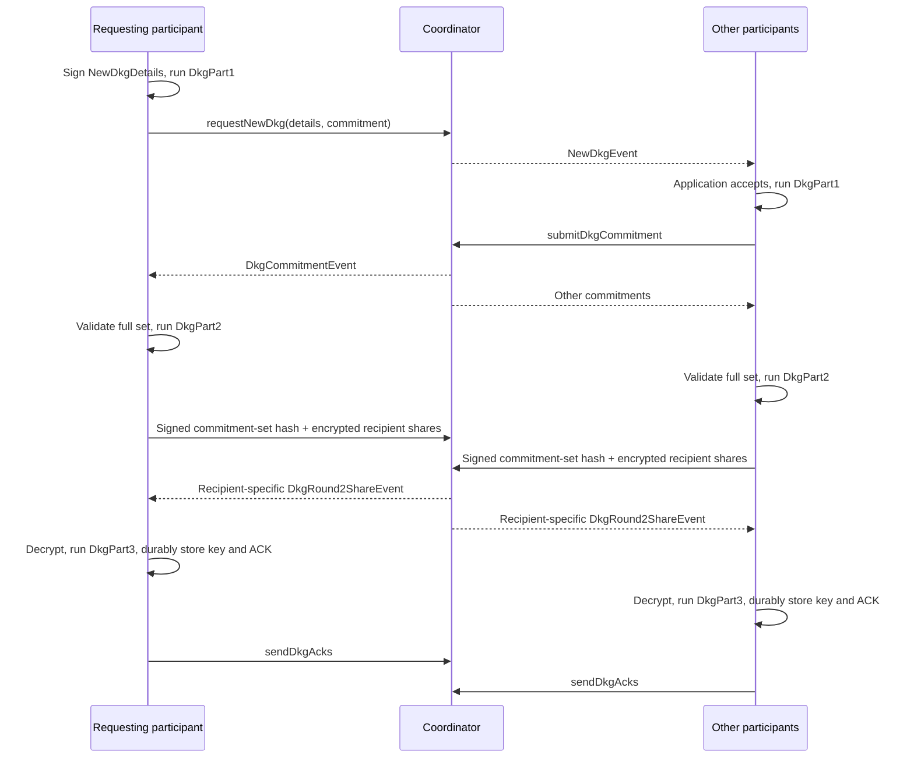

# Participant client

[Architecture overview](../architecture.md)

[`Client`](../packages/noosphere_client/lib/src/client/client.dart) is the
transport-independent participant state machine. It consumes an
`ApiRequestInterface`, `ClientConfig`, `ClientStorageInterface`, and
`GetPrivateKey`. An Iroh adapter supplies the network implementation of the
request interface; tests can connect the same client to a handler directly.

The application initiates requests and decides whether to accept incoming
proposals. The client verifies protocol data and performs cryptographic steps
under that decision. It does not choose an application's business policy.

## Login and local restoration

[`client_session.dart`](../packages/noosphere_client/lib/src/client/client_session.dart)
performs these steps:

1. Request the participant identity key with `KeyPurpose.login`.
2. Load one consistent client storage snapshot into `ClientCachedStorage`.
3. Request and sign the coordinator challenge.
4. Validate the returned snapshot's participant IDs, proposal signatures,
   thresholds, duplicate names/IDs, round membership and completion metadata.
5. Construct the client session, attach its event stream and extension timer.
6. Restore current proposals, process resumable rounds and verify completed
   signatures against locally stored keys.
7. Request missing DKG ACKs and process encrypted recovery shares.

Local maximum TTLs constrain received operation state. On login, prepared
signing records and durable rejections prevent unapproved or ambiguous rounds
from automatically using stored nonce material.

The session extension timer targets 15 seconds before expiry, with a minimum
wait of 10 seconds. Extension failures and event-processing errors end the
client session. The surrounding reconnecting runtime, if used, opens a new
session.

## Internal state and synchronization

`ClientState` contains the session ID/expiry, online participant set, expiring
DKG/signing maps and extension timer. `ClientDkgState` holds either round-one
commitments and the local secret, or the round-two secret, commitment set and
received shares. `ClientSigsState` holds proposal details and pending rounds.

Locks serialize creation of DKG/signing requests, ACK handling, work on each
operation and updates to each stored key. Persistent per-key lock objects
remain stable even when a `FrostKeyWithDetails` value is replaced. The event
listener invokes asynchronous handlers; it is these relevant locks, rather
than a claim that all callbacks globally await each other, that protect
overlapping work.

The public `keys` getter returns reconstructed copies; request/progress getters
provide public projections. Neither is a replacement for the host store.

## DKG sequence

[`client_dkg.dart`](../packages/noosphere_client/lib/src/client/client_dkg.dart)
first validates a local request's name/expiry and prevents duplicate active
names. The initiator signs `NewDkgDetails`, generates `DkgPart1` and sends its
commitment. Initiating a request also constitutes local acceptance.

Other participants receive the signed proposal and explicitly call
`acceptDkg`. All roster participants must contribute commitments before
`DkgPart2` starts, even if the eventual signing threshold is smaller than the
roster. This DKG is not a threshold-of-online-members enrollment step.

Part two validates commitment proofs and produces one share per recipient.
The participant signs the combined details/commitment-set hash and encrypts
each share using sender/recipient identity keys. The coordinator forwards each
recipient only its own ciphertext.

The recipient verifies the sender's identity signature, decrypts with
`KeyPurpose.decryptDkgSecret`, and collects all other participants' shares.
`DkgPart3` verifies those shares and creates `ParticipantKeyInfo`. The client
awaits key persistence before removing the DKG, storing its signed positive
ACK and sending that ACK. Proof, ciphertext or share failures reject the DKG
with a `DkgFault` reason.

If a participant logs out, round-two DKG state resets to round one, and its
round-one commitment is removed. Local temporary secrets are not durable;
restart cannot resume the old DKG merely from a proposal name. Applications
should observe actual stored key availability/ACKs rather than interpreting
one round-progress event as a completed key backup.

## Signing and ROAST replies

[`client_signing.dart`](../packages/noosphere_client/lib/src/client/client_signing.dart)
validates a requested expiry and verifies that every required key exists
locally. It signs the proposal using `KeyPurpose.signaturesDetails`, derives
public aggregate key information, generates initial commitments and persists
the prepared request plus nonces before submitting it.

On a received proposal, the client verifies the creator's signature and the
metadata, including that coordinator progress references roster participants
and a threshold belonging to one of the requested keys. Missing keys cause
durable rejection. Otherwise the application can accept or reject the request.
Initial acceptance generates commitments and nonces, durably prepares the
reply operation and sends it. Later progress updates produce
`SignaturesProgressClientEvent` without changing the local approval status.

When a new round arrives, the client checks:

- the signature index exists and is not duplicated;
- the commitment set contains valid roster members including this participant;
- its size matches the required key's threshold;
- local nonces exist for each included signature index.

`SignPart2` uses those nonces, the exact commitment set, signing details and
derived participant information to produce a signature share. The client also
generates new part-one material for a possible next round. The reply contains
the share and next commitment. The atomic preparation transaction stores next
nonces and the consumed transcript before sending the reply.

A response can yield more rounds or final signatures. For every final signature,
the participant derives the requested verification key, applies the Taproot
tweak when present, and verifies the Schnorr signature. Only after durable
request cleanup does it publish `SignaturesCompleteClientEvent`.

The client does not broadcast a blockchain transaction. Taproot metadata and
verified signatures are inputs to an importing wallet's own workflow.

## Approval and key access

`GetPrivateKey` is asynchronous so the host can access secure storage on demand.
`KeyPurpose` distinguishes login, DKG details/rounds/decryption, ACKs, request
details, recovery sharing/decryption and room enrollment. Returning an identity
key is not a generic approval of whatever operation is pending.

Ordinary FROST shares come from the client store; individual identity-key
callbacks authenticate protocol objects. The worker adds exact-proposal-byte
checking to approval commands, while the direct client API accepts a name or
request ID. Direct users must implement their own review-to-action binding.

## Explicit recovery-share exchange

[`client_key_sharing.dart`](../packages/noosphere_client/lib/src/client/client_key_sharing.dart)
implements `shareKeySecret`. It encrypts the stored FROST private share for
selected other participants and records where it was sent. A receiver verifies
the decrypted share against the sender's public share and stores reconstruction
progress. With enough shares, `KeyConstructionComplete` contains the full
private key and the client sends a signed reconstruction claim.

This intentionally reveals enough material to reconstruct the full key. It is
not part of routine signing or membership changes. The public worker facade
does not expose a `shareKeySecret` command and strips secrets from public key
events. A direct client's `SecretShareClientEvent` can contain secret-bearing
key details and needs different handling from worker events.

## Event lifetime and logout

`Client.events` is a single-subscription stream; subscribe promptly and keep
consuming it. Protocol faults become stream errors, disconnect the client and
close that session. `logout` cancels the extension timer, expires the session,
waits for recorded event work, cancels the network-event subscription and closes
its controller. The Iroh transport's cancellation path closes the connection.

A disconnected `Client` is not reused. Applications using the direct reconnect
API must subscribe to replacement clients; the worker handles that internally.
See [events](events.md) for the full conversion map and delivery limits.
