# Events

[Architecture overview](../architecture.md)

An event describes protocol activity. It is not automatically a command,
approval, persisted record or application state transition. Noosphere has
three primary event layers plus local room-manager streams.

```mermaid
flowchart LR
    S["Server state transition"] --> E["Domain Event"]
    E --> P["Protobuf Events: type + bytes"]
    P --> N["Envelope on Iroh session stream"]
    N --> D["Decoded domain Event"]
    D --> C["Client validates and updates protocol state"]
    C --> CE["ClientEvent"]
    CE --> W["Worker maps public fields"]
    W --> WE["NoosphereWorkerEvent"]
    WE --> A["Host updates application state"]
```



## Wire and domain events

[`Event`](../packages/noosphere/lib/api/events.dart) is a sealed base class
with `Writable`. The network schema uses the plural name `Events` for a single
type-and-bytes wrapper. `encodeEvent` on the server and `_decodeEvent` on the
client explicitly translate every supported variant.

| Enum number | Domain event | Payload and effect |
| --- | --- | --- |
| 0 | `ParticipantStatusEvent` | Participant ID and login flag; presence and DKG reset/removal effects |
| 1 | `NewDkgEvent` | Signed DKG details, creator and commitments already received |
| 2 | `DkgCommitmentEvent` | DKG name, participant and public commitment |
| 3 | `DkgRejectEvent` | DKG name and rejecting participant |
| 4 | `DkgRound2ShareEvent` | Name, commitment-set signature, sender and recipient ciphertext |
| 5 | `DkgAckEvent` | Nonempty set of signed key ACKs |
| 6 | `DkgAckRequestEvent` | Nonempty set of missing-ACK requests |
| 7 | `SignaturesRequestEvent` | Signed signing proposal, creator and current coordinator progress |
| 8 | `SignatureNewRoundsEvent` | Request ID and signature-index/commitment-set rounds |
| 9 | `SignaturesCompleteEvent` | Request ID and ordered final signatures |
| 10 | `SignaturesFailureEvent` | Request ID that can no longer reach threshold |
| 11 | `KeepaliveEvent` | No payload; optional stream activity |
| 12 | `SecretShareEvent` | Sender, group key and encrypted recovery share |
| 13 | `ConstructedKeyEvent` | Participant and signed claim of full-key reconstruction |
| 14 | `SignaturesProgressEvent` | Request ID, current threshold, contributing participants and stage |

`NewDkgEvent` and `SignaturesRequestEvent` implement `DetailsEvent`, allowing
common checks of the creator's signature and expiry. They carry authenticated
proposals; receiving them does not authorize acceptance.

Not every event is individually identity-signed. Presence and failure reports
are coordinator assertions, and a rejection attributed to a peer may reflect
what the coordinator claims. DKG proposals, signing proposals, ACKs and
commitment-set attestations have explicit cryptographic verification. Final
signatures are independently verified by the client.

Routing is intentional. Public proposals normally go to other sessions, while
the initiator already has its local proposal and RPC result. Encrypted DKG
shares go only to their recipient. A submission that completes signing returns
the result in the RPC and broadcasts it to other participants, avoiding an
unnecessary duplicate to its caller in that live path.

## Domain events become client events

[`client_events.dart`](../packages/noosphere_client/lib/src/client/client_events.dart)
validates and applies incoming domain events. Some are purely internal: a
commitment triggers DKG work; a new signing round can produce a reply; an ACK
updates a stored key. There is no required one-to-one correspondence between
wire events and UI notifications.

The public [`ClientEvent`](../packages/noosphere_client/lib/src/client/events.dart)
variants are:

| Client event | Content |
| --- | --- |
| `ParticipantStatusClientEvent` | Participant ID and online flag |
| `UpdatedDkgClientEvent` | Current `DkgInProgress` |
| `RejectedDkgClientEvent` | Removed proposal, attributed participant if any and `DkgFault` |
| `SignaturesRequestClientEvent` | Public signing request |
| `SignaturesProgressClientEvent` | Updated coordinator-observed signing progress |
| `SignaturesFailureClientEvent` | Removed/failed request |
| `SignaturesExpiryClientEvent` | Expired request |
| `SignaturesCompleteClientEvent` | Original details, creator and verified signatures |
| `SecretShareClientEvent` | Updated `FrostKeyWithDetails` and sender |

DKG faults distinguish ordinary rejection, proof-of-knowledge failure, invalid
ciphertext, invalid share and expiry. A completed DKG is stored as a key and
ACKed; there is no dedicated `DkgCompleteClientEvent` in this API. Inspect
current keys/storage when refreshing completed DKG state.

`SecretShareClientEvent` is particularly different from a worker UI event:
its key record includes secret material and can include a reconstructed full
private key. Direct clients must avoid forwarding that object into generic
logging or public application channels.

`Client.events` is single-subscription and should be consumed immediately.
Errors appear as stream errors and end that client session. Some notifications,
such as verified completions restored from login, can be emitted during login
and buffered until the caller subscribes.

## Client events become worker events

[`WorkerDtoMapper.event`](../lib/src/worker/dto_mapper.dart)
maps the participant event to a deliberate public DTO in
[`worker_models.dart`](../lib/src/worker_models.dart):

| Worker event | Source and payload |
| --- | --- |
| `WorkerSnapshotEvent` | Startup, replacement, explicit mutations, role changes and server-address refresh; complete public setup projection |
| `WorkerParticipantEvent` | Presence; public ID string and boolean |
| `WorkerDkgEvent` | DKG progress/rejection; proposal bytes and public progress fields |
| `WorkerSigningRequestEvent` | Proposal with request ID, creator, expiry, local status, exact bytes and coordinator progress |
| `WorkerSigningResultEvent` | Verified completion with request/proposal bytes, creator and signature byte arrays |
| `WorkerKeyUpdatedEvent` | Recovery-share update reduced to public key/name/description |
| `WorkerSessionReplacedEvent` | A replacement `Client` has been attached |
| `WorkerFailureEvent` | Sanitized failure category/message and interruption flag |

Every worker event has `setupId` and worker `generation`. This generation
identifies an isolate lifetime, not every reconnect session; reconnecting
within one worker keeps the same public generation. Replacement is indicated
by `WorkerSessionReplacedEvent` and the new snapshot.

The snapshot contains role-running/connection flags, an optional embedded
server coordinator address, online peers, DKGs, outstanding signing requests
and public keys. For a client-only setup, `snapshot.coordinator` is null:
this field describes an embedded server address, not the signer's selected pin.

The worker emits a snapshot on attachment before subsequent events from that
client session. Replacement emits `WorkerSessionReplacedEvent` followed by
`WorkerSnapshotEvent`. Initial setup may emit more than one snapshot as roles
finish starting. A snapshot is not automatically emitted after every incoming
client event; apply deltas or request `worker.snapshot(setupId)` when a fresh
whole view is needed.

## Application subscription and state

The following is the minimal worker subscription pattern; `applyEvent` is
application code, not a library API:

```dart
import 'dart:async';
import 'package:noosphere_flutter/noosphere_flutter.dart';

Future<({
  NoosphereWorker worker,
  StreamSubscription<NoosphereWorkerEvent> subscription,
})> openWorker(
  void Function(NoosphereWorkerEvent) applyEvent,
) async {
  final worker = await NoosphereWorker.start();
  final subscription = worker.events.listen(applyEvent);
  // The application can now call startSetup with its providers.
  // On disposal, await worker.close(), then subscription.cancel().
  return (worker: worker, subscription: subscription);
}
```

The application usually replaces its current projection on a snapshot and
updates matching fields for later deltas. Keep completed results and business
history separately: worker snapshots contain outstanding requests and public
keys, not a complete historical log of results.

For signing proposals, decode and review `proposalBytes`, then pass the exact
`WorkerSigningRequest` to `acceptSignatures` or `rejectSignatures`. The worker
compares its bytes with the still-pending proposal before acting. DKG approval
uses the same pattern with `WorkerDkgStatus`.

## Delivery guarantees and limits

The session handshake orders a snapshot before live session events. This is a
network/session ordering guarantee, not a transaction covering the importing
application's database.

The server's paused-session ring buffer holds 100 recent events and can replace
older entries. Client stream controllers may buffer before a listener attaches.
`worker.events` is broadcast and does not retain an event history for listeners
that subscribe later. Subscribe before `startSetup`.

There are no event sequence numbers, durable consumer offsets or generic
acknowledgments in `Events`. A reconnect creates a new snapshot, not an exact
replay of every missed transient event. Durable completed signatures can be
redelivered until expiry; the currently unused server completion ACK set does
not suppress them. Deduplicate application effects by request/application ID.

Worker command limits and approximate message-size limits do not constitute
a bounded queue for every consumer. Applications should keep handlers short
and serialize their own asynchronous persistence where required; Dart's
`listen` does not automatically await an asynchronous callback before the next
event.

## Room-manager streams

`RoomManager.snapshots` publishes public room snapshots for its emitted
transitions, and `rejectedEnrollments` publishes sanitized diagnostics including
room/invite IDs, a truncated public-key fingerprint, reason and time.
They are local broadcast streams, not entries in the ROAST `EventType` enum.
Do not assume every management method produces a snapshot event: invite issue,
for example, commits and returns the invite without calling `_emit`.

There are currently no room-management commands or room-progress event DTOs in
the public worker facade. Hosts using room APIs need the separate integration
described in [rooms and transitions](rooms-and-transitions.md).
