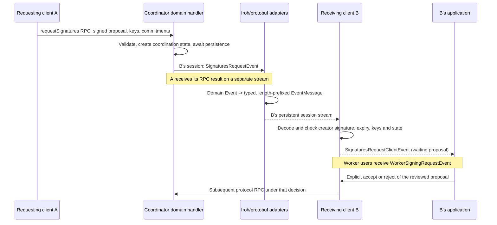

# Events

[Architecture overview](../architecture.md)

An `Event` is a typed message from the coordinator to a participant's protocol
state machine. It tells that participant about a proposal, another participant's
contribution, a round to process, or a change in coordinator state. Processing
it can update local state, verify cryptographic data, write storage, send a new
RPC, and eventually notify the importing application.

The shared `Event` model exists independently of Iroh and protobuf. The server
creates domain objects; the transport encodes and delivers them; the receiving
client reconstructs those objects and applies their protocol meaning. The UI
usually sees a later `ClientEvent` or `NoosphereWorkerEvent` projection.
Noosphere has three primary event APIs plus local room-manager streams.

```mermaid
flowchart LR
    S["Server state transition"] --> E["Domain Event"]
    E --> P["Protobuf EventMessage: typed oneof"]
    P --> N["Length-prefixed record on Iroh session stream"]
    N --> D["Decoded domain Event"]
    D --> C["Client validates and updates protocol state"]
    C --> CE["ClientEvent"]
    CE --> W["Worker maps public fields"]
    W --> WE["NoosphereWorkerEvent"]
    WE --> A["Host updates application state"]
```



## What an event means

[`Event`](../packages/noosphere/lib/api/events.dart) is a sealed family of
protocol messages, rather than a single record with arbitrary application
fields. Each variant also retains a domain binary writer and, except for the
empty keepalive, reader for persistence and snapshots. Live event transport
uses the corresponding typed protobuf message. Examples illustrate the
different jobs they perform:

- `NewDkgEvent` and `SignaturesRequestEvent` announce proposals for review.
- `DkgCommitmentEvent` and `DkgRound2ShareEvent` deliver cryptographic inputs.
- `SignatureNewRoundsEvent` tells selected signers which commitment sets to
  process under an already accepted signing request.
- `SignaturesCompleteEvent` delivers a result that the recipient must verify.
- `ParticipantStatusEvent` and `SignaturesProgressEvent` report coordinator
  observations; `KeepaliveEvent` carries no protocol-state update.

Receiving an event is therefore an input to the protocol, not evidence that
all its contents have already been accepted by the receiver. A well-formed
signing proposal still needs signature, expiry, key and state checks, and
receiving it does not supply the application's approval to sign.

The base class provides serialization behavior but no common event ID,
timestamp, sequence number, sender or recipient fields. Correlation belongs to
each variant: DKG events commonly use a DKG name; signing events use a
`SignaturesRequestId`. Sender/creator fields appear where needed. Group and
receiving participant context come from the authenticated session to which the
server routes the event.

| Message or object | Who produces it and why |
| --- | --- |
| Domain RPC request | Participant asks the coordinator to perform an operation, such as `requestSignatures` or `submitSignatureReplies` |
| RPC response | Coordinator answers on the opposite direction of the same QUIC bidi stream |
| Domain `Event` | Coordinator delivers protocol information to one or more participant sessions, independently of an outstanding RPC at those recipients |
| `ClientEvent` | Local client reports the outcome of protocol processing or a local action to its consumer |
| `NoosphereWorkerEvent` | Local worker exposes public fields to the Flutter host through a Dart isolate port |

The QUIC stream identifies one network call; there is no protobuf request ID. A
signing request's `SignaturesRequestId` identifies the signing operation across
calls, events and reconnection. It is not a generic delivery ID or
acknowledgment for an event.
The worker's `generation` is another separate identifier, for an isolate
lifetime; it is not part of the network `Event` encoding.

## Creation and routing on the coordinator

Domain methods create events after the relevant checks and state updates. For
example, [`_requestSignatures`](../packages/noosphere_server/lib/src/server/api_signing.dart)
validates the authenticated requester, signed proposal, expiry, supplied keys
and commitments. It creates the coordination state, awaits `_persist()`, then
publishes a `SignaturesRequestEvent` to the other sessions in that group.
The event preserves the signed proposal and adds the creator ID and the
coordinator's current progress. This ordering describes this operation; there
is no universal transaction that combines persistence and network delivery.

[`ServerRuntimeState`](../packages/noosphere_server/lib/src/server/state/state.dart)
routes through `sendEventToAll` and `sendEventToOthers`, or a domain method calls
a particular `ClientSession.sendEvent`. Each session exposes its own
`Stream<Event>`. The domain layer does not need to construct protobuf objects
or write a QUIC stream.

| Routing | Examples and reason |
| --- | --- |
| Other active sessions in the group | New DKG/signing proposals; the initiating participant already owns its proposal and receives an RPC response |
| All active sessions in the group | Signing progress and terminal failure reports |
| One recipient | An encrypted DKG round-two share or recovery share |
| Selected round participants | New signing rounds; the submitting caller can receive its rounds in the RPC response |
| RPC caller plus events to others | Final signatures can be returned to the caller whose submission completes signing and sent as completion events to the other sessions |

An event is not normally sent directly between participant endpoints. Even
recipient-encrypted shares travel through the coordinator. Routing determines
who receives the event; the share's inner ciphertext determines who can read
its secret content.

## From a Dart event to Iroh bytes, and back

There is a typed protobuf conversion followed by one framing step:

| Layer | Representation | What understands it |
| --- | --- | --- |
| Domain value | A concrete `Event`, such as `SignaturesRequestEvent` | Coordinator/client protocol code |
| Protobuf event | A concrete event message selected by `EventMessage.oneof event` | Generated protobuf code plus the domain/protobuf converters |
| Application frame | QUIC-varint message length, then `EventMessage` bytes | `encodeLengthPrefixedMessage` / `decodeLengthPrefixedMessages` |
| Transport | Bytes on the server-to-client half of the Iroh session QUIC stream | Iroh; it does not interpret the event's fields |

The singular protobuf `EventMessage` contains exactly one event. Its `oneof`
discriminator selects a generated message such as
`SignaturesRequestEvent`. The protobuf message exposes the event's fields;
canonical domain byte encodings remain only for nested cryptographic values
whose signed representation must not change.

For a signing proposal the nesting is:

```text
Iroh session stream bytes
  length: sizeof(EventMessage), QUIC varint
  EventMessage:
    signatures_request:              oneof field 8
      signed_details:                canonical Signed<...> bytes
      creator_id:                    32-byte participant identifier
      progress:
        threshold:                   uint32
        contributing_participant_ids: repeated 32-byte identifiers
        stage:                       protobuf enum
```

This is a structural illustration, not JSON sent over the wire. The signed
proposal stays in its canonical domain encoding because its Schnorr signature
binds the proposal's `sigHash`; protobuf separately describes the creator and
progress. The creator selects the roster key used to check that signature.
Progress is coordinator-reported metadata, validated separately from the
requester-signed proposal.

The implementation path is explicit:

1. [`ClientSession.sendEvent`](../packages/noosphere_server/lib/src/server/state/client_session.dart)
   enqueues a domain object for that recipient's session.
2. [`IrohDispatcher.ready`](../packages/noosphere_server/lib/src/iroh/dispatcher.dart)
   maps the session stream into `EventMessage` values with `encodeEvent`
   exported by [`wire.dart`](../packages/noosphere/lib/wire.dart) and implemented
   in [`event_wire.dart`](../packages/noosphere/lib/src/event_wire.dart).
3. [`_handleStartSession`](../packages/noosphere_server/lib/src/iroh/connection_handler.dart)
   writes those messages sequentially after `SessionStarted`, using
   [`encodeLengthPrefixedMessage`](../packages/noosphere/lib/src/framing.dart)
   and `SendStream.writeAll`. Socket writes do not hold the group's dispatch lane.
4. [`IrohClientApi`](../packages/noosphere_client/lib/src/iroh/client_api.dart)
   reads native chunks and runs `decodeLengthPrefixedMessages`. After the first
   `SessionStarted` record, `_pumpEvents` parses `EventMessage`, and shared `decodeEvent`
   reconstructs the domain value from the selected protobuf `oneof` message.
5. The resulting `Stream<Event>` is attached to `LoginCompleteResponse.events`.
   [`Client._handleEvent`](../packages/noosphere_client/lib/src/client/client_events.dart)
   performs the protocol-specific validation and state work. Selected outcomes
   become `ClientEvent` notifications; a worker maps those to public DTOs.

QUIC read chunks are not event boundaries: one read can contain several frames,
and one frame can span several reads. The frame limit applies to the entire
protobuf message body. A decoder accepting
protobuf only proves that it parsed the structure; it has not yet validated
nested domain values or authorized a protocol action. See
[protobuf and framing](protobuf-and-framing.md#persistent-event-stream) for the
schema and the separate validation stages.

## Worked example: a signing proposal reaches another participant

Assume A and B already have authenticated sessions in the same group and the
local keys needed for the proposed signature. The path below ends at B's
approval decision; it does not imply automatic acceptance.



For the successful incoming path, `_handleEvent` checks the creator against the
roster, verifies the signed details and rejects a duplicate active request.
`_handleSigsReq` checks the progress and locally held keys and establishes the
local request state. Missing keys can cause a durable rejection and a rejection
RPC instead of a proposal notification. Existing durable rejection/prepared
operation records also affect processing, especially during restoration.

The UI notification is a newly constructed local object; the protobuf message
is not forwarded unchanged to the UI. With a worker, `WorkerDtoMapper` serializes
the public proposal into `proposalBytes` and exposes request/progress fields.
Approval echoes those exact bytes, binding the action to the proposal reviewed
by the host. The worker event travels over a `SendPort`, not over Iroh.

Later, a `SignatureNewRoundsEvent` may cause the accepted request to produce
signature replies without prompting the UI for every cryptographic round.
A completion event is independently verified before a
`SignaturesCompleteClientEvent` / `WorkerSigningResultEvent` is exposed. These
are different protocol stages, not interchangeable meanings of “event”.

## Wire and domain events

The `EventMessage.event` oneof tags and the shared converter define this mapping.
The tag numbers are protobuf field numbers, not Dart class identifiers.

| Oneof tag | Protobuf field | Domain event | Payload and effect |
| --- | --- | --- | --- |
| 1 | `participant_status` | `ParticipantStatusEvent` | Participant ID and login flag; presence and DKG reset/removal effects |
| 2 | `new_dkg` | `NewDkgEvent` | Signed DKG details, creator and commitments already received |
| 3 | `dkg_commitment` | `DkgCommitmentEvent` | DKG name, participant and public commitment |
| 4 | `dkg_reject` | `DkgRejectEvent` | DKG name and rejecting participant |
| 5 | `dkg_round2_share` | `DkgRound2ShareEvent` | Name, commitment-set signature, sender and recipient ciphertext |
| 6 | `dkg_ack` | `DkgAckEvent` | Nonempty set of signed key ACKs |
| 7 | `dkg_ack_request` | `DkgAckRequestEvent` | Nonempty set of missing-ACK requests |
| 8 | `signatures_request` | `SignaturesRequestEvent` | Signed signing proposal, creator and current coordinator progress |
| 9 | `signature_new_rounds` | `SignatureNewRoundsEvent` | Request ID and signature-index/commitment-set rounds |
| 10 | `signatures_complete` | `SignaturesCompleteEvent` | Request ID and ordered final signatures |
| 11 | `signatures_failure` | `SignaturesFailureEvent` | Request ID that can no longer reach threshold |
| 12 | `keepalive` | `KeepaliveEvent` | No payload; optional stream activity |
| 13 | `secret_share` | `SecretShareEvent` | Sender, group key and encrypted recovery share |
| 14 | `constructed_key` | `ConstructedKeyEvent` | Participant and signed claim of full-key reconstruction |
| 15 | `signatures_progress` | `SignaturesProgressEvent` | Request ID, current threshold, contributing participants and stage |

`NewDkgEvent` and `SignaturesRequestEvent` implement `DetailsEvent`, allowing
common checks of the creator's signature and expiry. They carry authenticated
proposals; receiving them does not authorize acceptance.

Not every event is individually identity-signed. Presence and failure reports
are coordinator assertions, and a rejection attributed to a peer may reflect
what the coordinator claims. DKG proposals, signing proposals, ACKs and
commitment-set attestations have explicit cryptographic verification. Final
signatures are independently verified by the client.

## Domain events become client events

[`client_events.dart`](../packages/noosphere_client/lib/src/client/client_events.dart)
validates and applies incoming domain events. Some are purely internal: a
commitment triggers DKG work; a new signing round can produce a reply; an ACK
updates a stored key. There is no required one-to-one correspondence between
wire events and UI notifications.

The public [`ClientEvent`](../packages/noosphere_client/lib/src/client/events.dart)
variants are:

| Client event | Content |
| --- | --- |
| `ParticipantStatusClientEvent` | Participant ID and online flag |
| `UpdatedDkgClientEvent` | Current `DkgInProgress` |
| `CompletedDkgClientEvent` | Newly completed, durably stored local `FrostKeyWithDetails` |
| `RejectedDkgClientEvent` | Removed proposal, attributed participant if any and `DkgFault` |
| `SignaturesRequestClientEvent` | Public signing request |
| `SignaturesProgressClientEvent` | Updated coordinator-observed signing progress |
| `SignaturesFailureClientEvent` | Removed/failed request |
| `SignaturesExpiryClientEvent` | Expired request |
| `SignaturesCompleteClientEvent` | Original details, creator and verified signatures |
| `SecretShareClientEvent` | Updated `FrostKeyWithDetails` and sender |

DKG faults distinguish ordinary rejection, proof-of-knowledge failure, invalid
ciphertext, invalid share and expiry. `CompletedDkgClientEvent` is emitted after
a local FROST key has been durably stored. There is no corresponding generic
network “DKG complete” event: each participant completes from its received
shares, and signed DKG ACKs communicate key possession. Current keys/storage
remain the source for restoring the complete local key view.

`CompletedDkgClientEvent` and `SecretShareClientEvent` carry local key records
that include secret material. The latter can include a reconstructed full
private key. Direct clients must avoid forwarding those records into generic
logging or public application channels; the worker projection selects public
key/name/description fields.

`Client.events` is single-subscription and should be consumed immediately.
Errors appear as stream errors and end that client session. Some notifications,
such as verified completions restored from login, can be emitted during login
and buffered until the caller subscribes.

## Client events become worker events

[`WorkerDtoMapper.event`](../lib/src/worker/dto_mapper.dart)
maps the participant event to a deliberate public DTO in
[`worker_models.dart`](../lib/src/worker_models.dart):

| Worker event | Source and payload |
| --- | --- |
| `WorkerSnapshotEvent` | Startup, replacement, explicit mutations, role changes and server-address refresh; complete public setup projection |
| `WorkerParticipantEvent` | Presence; public ID string and boolean |
| `WorkerDkgEvent` | DKG progress/rejection; proposal bytes and public progress fields |
| `WorkerSigningRequestEvent` | Proposal with request ID, creator, expiry, local status, exact bytes and coordinator progress |
| `WorkerSigningResultEvent` | Verified completion with request/proposal bytes, creator and signature byte arrays |
| `WorkerKeyUpdatedEvent` | Completed DKG or recovery-share update reduced to public key/name/description |
| `WorkerSessionReplacedEvent` | A replacement `Client` has been attached |
| `WorkerFailureEvent` | Sanitized failure category/message and interruption flag |

Every worker event has `setupId` and worker `generation`. This generation
identifies an isolate lifetime, not every reconnect session; reconnecting
within one worker keeps the same public generation. Replacement is indicated
by `WorkerSessionReplacedEvent` and the new snapshot.

The snapshot contains role-running/connection flags, an optional embedded
server coordinator address, online peers, DKGs, outstanding signing requests
and public keys. For a client-only setup, `snapshot.coordinator` is null:
this field describes an embedded server address, not the signer's selected pin.

The worker emits a snapshot on attachment before subsequent events from that
client session. Replacement emits `WorkerSnapshotEvent`, then
`WorkerSessionReplacedEvent`, then any events buffered during attachment.
Initial setup may emit more than one snapshot as roles finish starting. A snapshot is not automatically emitted after every incoming
client event; apply deltas or request `worker.snapshot(setupId)` when a fresh
whole view is needed.

## Application subscription and state

The following is the minimal worker subscription pattern; `applyEvent` is
application code, not a library API:

```dart
import 'dart:async';
import 'package:noosphere_flutter/noosphere_flutter.dart';

Future<({
  NoosphereWorker worker,
  StreamSubscription<NoosphereWorkerEvent> subscription,
})> openWorker(
  void Function(NoosphereWorkerEvent) applyEvent,
) async {
  final worker = await NoosphereWorker.start();
  final subscription = worker.events.listen(applyEvent);
  // The application can now call startSetup with its providers.
  // On disposal, await worker.close(), then subscription.cancel().
  return (worker: worker, subscription: subscription);
}
```

The application usually replaces its current projection on a snapshot and
updates matching fields for later deltas. Keep completed results and business
history separately: worker snapshots contain outstanding requests and public
keys, not a complete historical log of results.

For signing proposals, decode and review `proposalBytes`, then pass the exact
`WorkerSigningRequest` to `acceptSignatures` or `rejectSignatures`. The worker
compares its bytes with the still-pending proposal before acting. DKG approval
uses the same pattern with `WorkerDkgStatus`.

## Delivery guarantees and limits

The client opens the persistent stream with `StartSession` and finishes its
sending half. The server creates the session, captures its snapshot, and
subscribes to queued/live events through the group's dispatch lane before it
writes `SessionStarted(snapshot)`. It then writes event records on the same
response direction. This closes the snapshot/subscription gap without a
separate `Ready` control message or event-history replay.

[`LoginCompleteResponse`](../packages/noosphere/lib/api/responses/login_complete.dart)
reuses concrete event types in some of its collections: pending DKGs, signing
proposals, pending signing rounds and encrypted recovery shares. These are
embedded domain records inside `SessionStarted.snapshot`, not individual
`EventMessage` records. Completed results use `CompletedSignaturesRequest`,
which includes the original signed proposal as well as signatures, so they can
be verified without relying on an earlier live proposal event. The Dart
`events` stream itself is not serialized; the client adapter supplies it when
decoding the snapshot.

Transport readiness does not imply completion of application processing or
consent to any proposal. Transport delivery on one session stream is ordered; asynchronous
client handlers use their relevant operation/key locks. There is no global
promise that every asynchronous application callback completes before the next
event arrives, nor a transaction covering the application's database.

RPC replies use other QUIC streams, so their arrival cannot be globally ordered
against session events. In particular, a caller may observe signing progress
while still waiting for its RPC result. Use operation state and identifiers,
not an assumption that all related events follow the RPC future's completion.

The server's paused-session ring buffer holds 100 recent events and can replace
older entries. It is used when that controller's subscription is paused; it is
not a durable log or a universal 100-event limit on every queue. Stream
controllers can also buffer before a listener attaches.
`worker.events` is broadcast and does not retain an event history for listeners
that subscribe later. Subscribe before `startSetup`.

There are no event sequence numbers, durable consumer offsets or generic
acknowledgments in `EventMessage`. A reconnect creates a new snapshot, not an exact
replay of every missed transient event. Durable completed signatures can be
redelivered until expiry; the currently unused server completion ACK set does
not suppress them. Deduplicate application effects by request/application ID.

Worker command limits and approximate message-size limits do not constitute
a bounded queue for every consumer. Applications should keep handlers short
and serialize their own asynchronous persistence where required; Dart's
`listen` does not automatically await an asynchronous callback before the next
event.

## Changing or adding a network event

A network event is a protocol change spanning both peers. Define the domain
variant in `api/events.dart`, add its typed message and a new `EventMessage.event`
oneof field in `noosphere.proto`, regenerate bindings, and update the shared
converter exported by `wire.dart`. Then define when the coordinator emits it,
its recipients, client-side validation and state effects, and whether it needs
a public client or worker projection. A new protobuf message alone does not
implement any of those behaviors, and existing clients have no generic handling
path for opaque events.

Decide explicitly whether its information belongs in persistence and reconnect
snapshots. Test the domain round trip, protobuf/framing round trip, actual
routing, invalid input, state effects and restoration behavior where relevant.
Current examples are the [domain envelope tests](../packages/noosphere/test/api/types/metadata_envelope_test.dart),
[protobuf tests](../packages/noosphere/test/protocol_test.dart), and
[Iroh session tests](../packages/noosphere_server/test/iroh_client_api_test.dart).
Apply the [preview version policy](../packages/noosphere/spec/VERSIONING.md);
compatibility is not established merely by retaining the same outer envelope.
For application-defined messages, see [generic data](generic-data.md).
The proposed negotiated extension envelope and registry design is described in
[protocol extensions](protocol-extensions.md).

## Room-manager streams

`RoomManager.snapshots` publishes public room snapshots for its emitted
transitions, and `rejectedEnrollments` publishes sanitized diagnostics including
room/invite IDs, a truncated public-key fingerprint, reason and time.
They are local broadcast streams, not variants of the ROAST `EventMessage.event`
oneof.
Do not assume every management method produces a snapshot event: invite issue,
for example, commits and returns the invite without calling `_emit`.

There are currently no room-management commands or room-progress event DTOs in
the public worker facade. Hosts using room APIs need the separate integration
described in [rooms and transitions](rooms-and-transitions.md).
