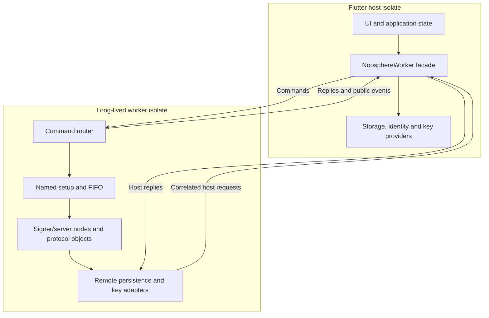

# Flutter facade and isolates

[Architecture overview](../architecture.md)

The Flutter package adapts the same participant and coordinator cores to
desktop applications. `NoosphereNode` provides direct lifecycle composition;
`NoosphereWorker` runs nodes inside a long-lived isolate and exposes a smaller,
public message API to the host.

## Direct nodes

[`NoosphereNode.start`](../lib/src/iroh_node.dart) requires a client role,
server role, or both. Startup initializes bindings, starts the server first
when present, and then starts the reconnecting client. The host supplies the
client's bootstrap address and trusted pin; combining roles does not bypass
authentication or automatically invent that trust relationship.

Server startup loads/creates the host identity, optionally opens `RoomManager`,
starts `IrohServer`, and starts its serving future. Client startup calls
`ReconnectingIrohClient.connect` with storage and key providers. Partial startup
failure cleans up already-started roles while preserving the original error.

`close` is idempotent, closes client before server, joins serving and retains
the first cleanup error while still attempting remaining cleanup. Direct
callers can access the server/client objects and must handle replacement client
sessions themselves.

Direct nodes execute Dart orchestration and synchronous cryptographic work on
the calling isolate. Marking a method `async` does not move its synchronous
work off the UI thread. The worker is the package's mechanism for doing that.

## Host and worker responsibilities



The worker owns Iroh endpoints/connections, `Client`, server handlers, active
Frosty objects and caches. The host owns UI state, database objects, provider
callbacks and secure key access policy. A callback/database/native handle does
not cross the boundary. Serializable inputs and results do.

This separation does **not** keep every secret byte exclusively on the host.
Private keys requested through the bridge and secret-bearing stored FROST
records/nonces are serialized into the worker when required. Public events
strip those secrets. The isolate is a scheduling and ownership boundary, not
a hardware keystore or OS memory isolation boundary.

## Startup and initialization

[`NoosphereWorker.start`](../lib/src/worker.dart) prepares root Flutter bindings,
creates receive ports for messages/errors/exits, assigns a monotonically
increasing generation and spawns `runNoosphereWorker`. The bootstrap message
contains its host port and limits. The worker initializes native bindings and
replies `ready` with its own command port before `start` completes.

[`NoosphereFlutter`](../lib/src/initialization.dart) separates
`prepareRootIsolate` from `initializeNative`. The root calls
`WidgetsFlutterBinding.ensureInitialized`; a worker calls native initialization
without touching that root-only binding. Direct-node callers use `initialize`,
which performs both. Cached futures share concurrent initialization and retain
the original failure rather than racing another attempt.

Native initialization loads Coinlib, initializes Iroh and loads Frosty. Frosty's
Flutter-specific package-config failure falls back to its FRB loader. On macOS,
Iroh's framework is opened explicitly where available to keep identically named
Iroh/Frosty bridge symbols in separate lookup namespaces. These library paths
remain internal to the facade.

Host code that creates/decodes native Frosty storage objects may also need
`NoosphereFlutter.initialize()` in the host isolate. Starting a worker only
prepares root Flutter bindings on the host; native binding statics are
isolate-local even when underlying Rust resources are process-wide.

## Internal message protocol

[`worker_protocol.dart`](../lib/src/worker_protocol.dart) defines version 1 and
configuration encoders. This is Dart port communication, not protobuf:

```text
command:
  version, generation, type='command', commandId,
  operation, setupId, payload
reply:
  version, generation, type='reply', commandId, ok,
  result OR code/message
host request:
  version, generation, type='hostRequest', hostRequestId,
  setupId, operation, payload
host reply:
  version, generation, type='hostReply', hostRequestId, ok,
  result OR code/message
event:
  version, generation, type='event', event=<public DTO>
```

Messages with a stale generation or wrong version are ignored. Separate maps
of completers correlate command replies and host replies. DTOs and byte arrays
are copied deliberately where public snapshots are constructed; native objects
are reconstructed from serialized values in the receiving isolate.

The default approximate message limit is 8 MiB and the default outstanding
command limit is 64. The same configured count bounds pending worker-to-host
requests. Size accounting walks maps, lists, bytes and known DTO fields; it is
an estimate rather than an exact serialized wire length. Adding a new public
DTO requires updating that accounting.

Startup and host-provider timeouts default to 30 seconds; shutdown stages
default to 5 seconds. There is no blanket per-command execution timeout in
`_invoke`; command futures can depend on lower-layer timeouts or worker exit.
Oversized events are replaced with a failure event, and oversized replies
produce a command error.

## Setups, roles and commands

A setup ID is 1–128 characters. One worker can own several setups; each has its
own FIFO, signer node and server node. `startSetup` can add a missing role to
an existing setup but rejects starting an already-running role again.
Independent setups share the isolate event loop, so synchronous work can still
delay other work in that worker.

| Public operation | Effect |
| --- | --- |
| `startSetup` | Bind host providers and start selected roles |
| `stopSetup` | Stop server, signer or both |
| `lockSigner` | Stop only the signer; keep an embedded coordinator available |
| `snapshot` | Obtain the current public setup projection |
| `updateSignerAddress` | Refresh future connection hints under the existing pin |
| `switchCoordinator` | Stop signer, check pending storage, persist an approved selection, connect using its pin |
| `requestDkg`, `requestSignatures` | Submit the supplied proposal; caller authorizes local initiation |
| `acceptDkg`, `rejectDkg` | Act on the matching current DKG proposal bytes |
| `acceptSignatures`, `rejectSignatures` | Act on the matching current signing proposal bytes |
| `exportIrohServerIdentity` | Export the host-owned stored server identity secret |
| `close` | Close every setup and the isolate bridge |

Switching is a serialized, non-atomic operation on one local signer. The
application owns coordinator approval and durable selection; the worker owns
the stop/check/persist/connect ordering and local signing-state checks. See
[coordinator switching](../packages/noosphere/spec/COORDINATOR_ROTATION.md)
for partial-failure recovery and the host workflow.

`shareKeySecret` and room-management operations are not public worker commands.
A custom `ServerApiHandler` cannot cross the worker boundary; option encoding
rejects it. Direct nodes can accept such a handler within their own isolate.

Approval compares the submitted proposal bytes to the still-current proposal
under the setup's serialized operation path. A reused DKG name or stale signing
view is insufficient to authorize a changed proposal. Host key access remains
separate from this approval.

## Storage and key requests back to the host

The worker's remote adapters implement the normal storage interfaces, so the
core client/server need no knowledge of isolates. For example:

```text
ClientCachedStorage.prepareSignaturesOperation
  -> _RemoteClientStorage
  -> _HostBridge.request('storage.prepareSignatures')
  -> NoosphereWorker._handleHostRequest
  -> _HostSetup serialized provider call
  -> host ClientStorageInterface transaction
  -> correlated hostReply
  -> client may now send its RPC
```

Host requests include setup identity, and key requests additionally identify
the participant and `KeyPurpose`. The host checks the participant against its
bound setup. Ordinary public events never contain the returned key bytes.

Room/server provider queues preserve ordering for the same instance across
worker replacement; per-setup storage serialization also coordinates the
client store. The [persistence chapter](state-and-persistence.md) explains
their scopes and why provider timeouts are not transaction cancellation.

## Sessions, snapshots and address updates

The setup attaches the current `Client`, subscribes to its events and emits a
snapshot before later events from that session. It listens for replacement
clients from `ReconnectingIrohClient.sessions`, cancels the old subscription,
attaches the new client and emits replacement then snapshot events. Host
applications do not retain a worker-owned `Client` object.

For an embedded server, the worker polls the public endpoint address snapshot
every 100 ms and emits only changed addresses. This avoids opening Iroh's
reactive address stream inside a worker: its native stream-cancellation registry
is process-wide while Dart token statics are isolate-local. The workaround uses
the published dependency API and does not require a patched Iroh package.

## Shutdown, failure and Flutter lifecycle

Graceful close stops accepting new commands, waits for already accepted work,
closes setups in reverse order, closes the host bridge and ends the receive
port. The facade waits for the close reply and isolate exit. Pending commands
fail if the isolate dies unexpectedly; errors exposed publicly omit remote
stacks and arbitrary native payloads.

If shutdown cannot finish within its bounds, the facade kills the isolate.
Forced or unexpected native-worker termination sets an in-process
`unsafe_restart` guard. Killing Dart cannot establish that native sockets/tasks
were released, so starting another native worker in that process is rejected.
Restarting the application creates a fresh process and reloads durable state.

An optional `NoosphereWorkerLifecycleObserver` or `NoosphereLifecycleObserver`
attempts bounded close on terminal `detached`. `inactive` does nothing because
desktop focus loss should not stop a signer. Applications should still await
explicit shutdown during logout/exit; lifecycle callbacks are not a substitute
for durable state.
