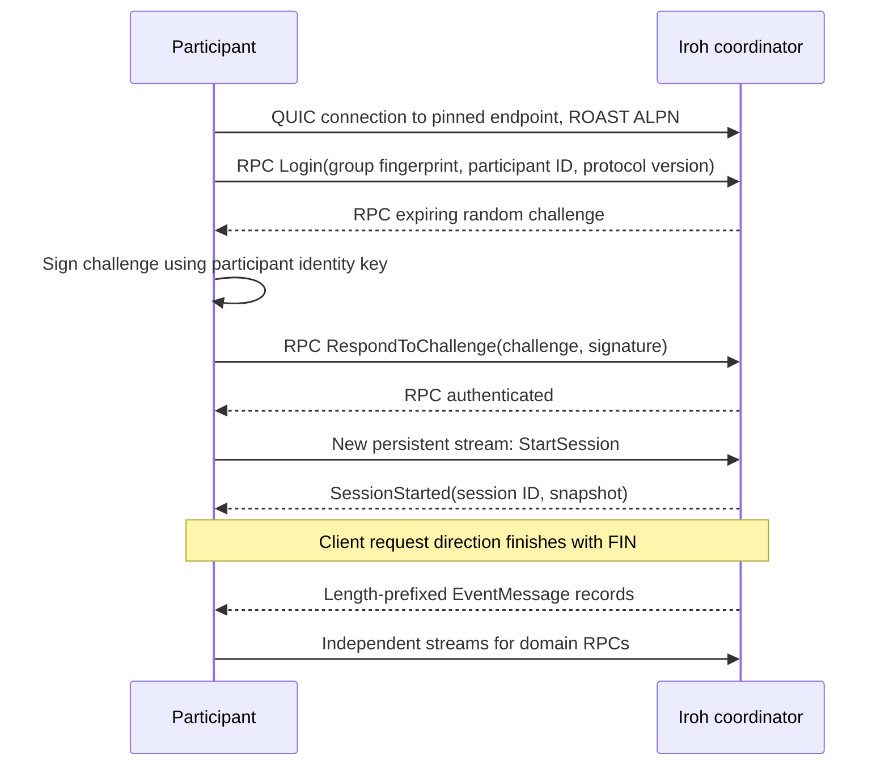

# Iroh transport

[Architecture overview](../architecture.md)

Iroh supplies the endpoint identity, peer connection establishment, direct/relay
connectivity and QUIC streams. Noosphere builds authenticated participant
sessions, framed RPCs and event delivery on top. It does not use Iroh as a
database, consensus system, generic event broker or signing coordinator.

## Endpoint identity and trust

[`IrohServer.start`](../packages/noosphere_server/lib/src/iroh/server.dart)
requires a host-supplied `SecretKey` and `ServerPersistence`. It initializes
Iroh and calls `Endpoint.bind` with that key, ALPNs and relay mode. Loading or
deriving the identity happens in the application before this call. The Flutter
facade can derive it deterministically from a BIP-39 seed through BIP-85; it
does not persist an identity secret.

An `EndpointAddr` contains an endpoint ID plus optional relay URLs and IP
addresses. The ID is authoritative; the other fields are connection hints.
The client may supply just the ID and rely on Iroh discovery. Noosphere passes
these hints to Iroh; it does not implement NAT traversal itself.

[`IrohClientEndpoint`](../packages/noosphere_client/lib/src/iroh/endpoint.dart)
checks the bootstrap address ID against the independently configured
`pinnedServerId` before connecting. After connection, it checks
`connection.remoteId` against that pin too. A mismatch closes the connection.
The application is responsible for obtaining and approving the pin through a
trusted mechanism.

The Iroh identity and participant identity are separate. The remote endpoint
ID identifies the transport peer. The signed Noosphere challenge proves that
the peer controls a secp256k1 participant identity key in the selected roster.

Relay policies map shared `IrohRelayConfig` values to Iroh's default network,
disabled, staging or custom relay modes. A client endpoint wrapper can own a
newly bound endpoint or borrow one; closing a borrowed wrapper does not close
the application-owned endpoint.

## ALPN routing

| ALPN | Protocol |
| --- | --- |
| `noosphere/roast/1` | Direct typed protobuf for login, DKG, signing and events |
| `noosphere/roast-enrollment/1` | Direct typed protobuf for invite enrollment, when room support is enabled |

The server binds both on the same endpoint when a `RoomManager` is provided.
It routes each accepted connection according to its negotiated ALPN. Freezing
a room adds its group to the dispatcher; it does not replace or rebind Iroh.
Both ALPNs dispatch a leading QUIC-varint operation ID directly to concrete
protobuf request/response types. Each handler accepts only the operations
exposed on its ALPN.

## Authentication and snapshot handshake

[`ConnectionContext`](../packages/noosphere_server/lib/src/iroh/connection_context.dart)
enforces `connected -> challengeIssued -> authenticated -> sessionAttached ->
ready -> closed`. The issued challenge is bound to that connection's pending
group and participant. A challenge signed on another connection cannot simply
be transplanted into it.

Authentication succeeds before creating the logical session. Only
`StartSession` replaces a participant's previous session. This prevents merely
starting authentication from displacing a live signer.

`SessionStarted` carries a snapshot captured through the group's serialized
dispatcher. The server subscribes to queued/live events before writing that
snapshot, then sends event records on the same response direction. No `Ready`
control is required; the stream controller buffers while the high-level client
attaches.

The session ID in a domain RPC must match the ID bound to the connection.
It is not a standalone bearer token that can be used on any connection.

## RPC streams and session stream

Each `_rpc` call opens a new bidirectional stream, writes an operation QUIC
varint followed by one concrete request protobuf, finishes its sending half,
and awaits a status varint plus one concrete response protobuf through FIN.
The stream itself correlates the response, so no request ID is generated or
echoed. A semaphore bounds concurrent client RPC streams.

The session uses a separate long-lived bidirectional stream. The client sends
`StartSession` and FIN; the server sends `SessionStarted` followed by event
records until logout/connection close. A slow RPC does not occupy that same byte
stream. QUIC's independent streams do not remove the need to serialize
mutations of a group's domain state.

The server tracks active connections and streams, resets streams over the
configured limit, and applies read/write and operation timeouts. Network
writes happen after domain dispatch releases its group lane, so a slow receiver
does not retain that lane while its bytes are being written.

## Event delivery on the session stream

Each receiving participant has its own server-side `ClientSession` and
`Stream<Event>`. `sendEventToAll`, `sendEventToOthers`, or an explicit session
selection determines which streams receive a domain object. That decision is
made by the coordinator's protocol code; Iroh does not provide the group's
broadcast or recipient-selection semantics.

`IrohDispatcher` maps each queued/live object through `encodeEvent` into an
`EventMessage`. The connection handler prefixes each message with its QUIC
varint length and awaits the write on the server-to-client sending half. The
client incrementally reads records, selects a domain decoder using the protobuf
event type, and passes a `Stream<Event>` into the participant client.
[The complete event path](events.md#from-a-dart-event-to-iroh-bytes-and-back)
explains the data representations and subsequent validation.

The client finishes the session stream's request direction after `StartSession`.
Participant contributions such as commitments and signature replies go through
domain RPCs on separate streams; clients do not publish arbitrary
`EventMessage` values back to the coordinator. There is no per-event
request/response pair on the session stream.

The byte stream preserves its own write order, but RPC responses and other
participants' streams have independent delivery timing. A successful event
write does not acknowledge that the peer processed, persisted or approved the
event. Reconnection obtains a new session snapshot instead of continuing from
a durable event offset.

## Actual default limits

| Setting | Core API default | Flutter option default |
| --- | --- | --- |
| Protobuf body maximum | 1 MiB | 1 MiB |
| Client concurrent RPC streams | 32 | 2 |
| Server streams per connection, including event stream | 32 | 4 |
| Server connections | 128 | 128 |
| Client connect timeout | 15 seconds | 15 seconds |
| Authentication timeout | 10 seconds | 10 seconds |
| RPC timeout | 30 seconds | 30 seconds |
| Server shutdown timeout | 5 seconds | 5 seconds |

Sources are [client config](../packages/noosphere_client/lib/src/iroh/config.dart),
[server config](../packages/noosphere_server/lib/src/config/iroh.dart),
[Flutter client options](../lib/src/client_options.dart) and
[Flutter server options](../lib/src/server_options.dart). Flutter's four server
slots accommodate one session stream, two RPC streams and transition headroom.
The client limit counts RPCs; the server limit counts all accepted streams.

These limits bound specific resources. They are not a full application-level
rate-limiting or abuse-prevention system, and not every underlying controller
or waiting queue has a hard capacity.

## Reconnect behavior

[`ReconnectingIrohClient`](../packages/noosphere_client/lib/src/iroh/reconnecting_client.dart)
owns a sequence of separate `Client`/`IrohClientApi` sessions while reusing its
root endpoint. Initial connection failure fails `connect`; after a live session
disconnects, the runtime retries with exponential backoff. Defaults are 250 ms
initial delay, multiplier 2, jitter 0.2 and a 30-second cap.

Every successful reconnect performs fresh authentication, reloads client
storage, receives a fresh snapshot and creates a new `Client`. The initial
client is `current`; later clients arrive on the broadcast `sessions` stream.
Direct users must replace retained client references and subscriptions.
Workers perform this replacement internally and publish replacement/snapshot
events to the host.

Reconnect never replays an in-flight mutating RPC. The current adapter does
not implement a server-side request-ID deduplication cache. If a request timed
out after being accepted, reconnect does not establish whether it committed.
Use [durable operation records](state-and-persistence.md).

`updateTransportConfig` changes hints for a later connection attempt and rejects
changing the pin. Flutter's `updateSignerAddress` enforces the same rule.
Changing coordinator identity uses a separate app-approved
[rotation workflow](rooms-and-transitions.md).

## Shutdown and confidentiality

Client logout closes the connection and releases its owned endpoint. Server shutdown closes
the endpoint, waits for connection handlers and then drains the dispatcher
with configured time bounds. The Flutter node joins its server's serving task.

Iroh protects traffic between connected endpoints. The coordinator is an
endpoint and can read ordinary proposals and application message text. DKG
and recovery shares have an additional recipient-specific `ECCiphertext`
layer using participant identity keys, so their plaintext need not be exposed
to the coordinator. Protobuf byte fields themselves add no confidentiality.
