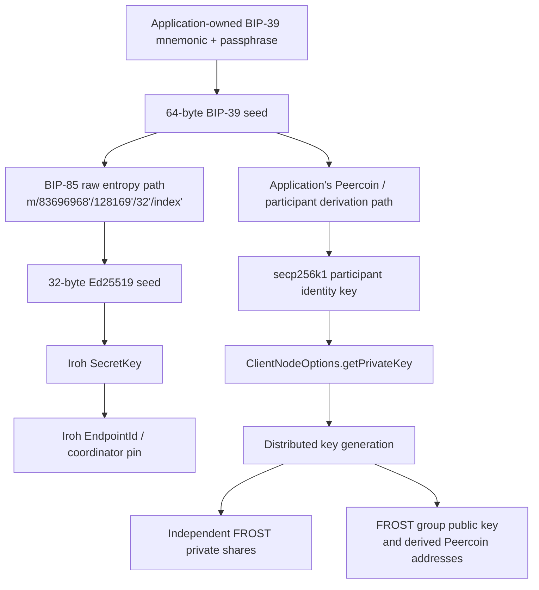

# Mnemonic and identity workflow

[Architecture overview](../architecture.md)

The Flutter integration can use the same BIP-39 mnemonic that anchors a
Peercoin wallet to recreate its Iroh endpoint identity. The mnemonic is not
given to Noosphere or Iroh. The application converts it, together with the
optional BIP-39 passphrase, into the standard 64-byte BIP-39 seed and derives
separate keys for separate purposes.



## What shares the mnemonic

Two identity branches may have the same BIP-39 seed as their common root:

| Branch | Derivation owner | Result | Use |
| --- | --- | --- | --- |
| Participant identity | Application-defined Peercoin/wallet derivation | secp256k1 private key | Login challenge signatures, proposal signatures, DKG attestations and encryption/decryption of shares |
| Iroh server identity | `deriveIrohSecretKeyFromBip39Seed` | 32-byte Ed25519 `SecretKey` | Iroh endpoint authentication and stable `EndpointId` |

These branches share recovery material but never reuse raw private-key bytes.
The participant path remains application policy; Noosphere obtains that key
only through `ClientNodeOptions.getPrivateKey`. The Iroh branch uses BIP-85's
standard raw-entropy application with 32 output bytes:

```text
m/83696968'/128169'/32'/index'
```

All path components are hardened. After deriving the BIP-32 child, BIP-85
applies HMAC-SHA512 with `bip-entropy-from-k`; the first 32 bytes become Iroh's
Ed25519 secret seed. `index` defaults to zero. Assign a different stable index
to every independent endpoint that the same mnemonic must operate
simultaneously.

## What does not come from the mnemonic

The FROST threshold-signing key is not a mnemonic child. Participants create
it jointly during DKG. Each participant stores a different FROST private share,
and the shared group public key is used to verify ROAST-produced signatures and
derive the resulting Peercoin addresses.

This distinction matters:

- the participant identity key proves which roster member is acting;
- the Iroh key proves which transport endpoint is serving;
- the FROST share authorizes threshold signing after DKG.

Compromise or recovery of the mnemonic recreates the first two identities, but
does not by itself recreate a completed FROST key. FROST recovery follows its
own stored-share and recovery-share procedures.

## Flutter startup

The host keeps mnemonic handling outside this package:

```dart
await NoosphereFlutter.initialize();

final bip39Seed = await walletSeedProvider(); // Exactly 64 bytes.
final irohIndex = accountIrohIdentityIndex;

final node = await NoosphereNode.start(
  server: EmbeddedServerOptions(
    serverConfig: serverConfig,
    getIrohSecretKey: () => deriveIrohSecretKeyFromBip39Seed(
      bip39Seed,
      index: irohIndex,
    ),
    serverPersistence: serverPersistence,
  ),
  client: ClientNodeOptions(
    clientConfig: clientConfig,
    bootstrapAddress: trustedAddress,
    pinnedServerId: trustedServerId,
    storage: clientStorage,
    getPrivateKey: getMnemonicDerivedParticipantKey,
  ),
);
```

For a direct `NoosphereNode`, the key initializer runs during server startup
and the resulting `SecretKey` is passed to `IrohServer.start`. For a
`NoosphereWorker`, the initializer runs in the Flutter host isolate; only the
derived 32-byte Iroh secret crosses into the worker startup message. The
mnemonic, BIP-39 passphrase and 64-byte seed do not cross that boundary.

The library has no embedded-server identity store and does not export or
restore identity secrets. Given the same mnemonic, passphrase and index, the
application derives the same `SecretKey` and therefore the same `EndpointId`
after restart.

## Recovery and safety rules

- Preserve the mnemonic, its optional passphrase, and the mapping from an
  account/setup to its Iroh identity index. The index is not secret, but it must
  be stable.
- Changing the mnemonic, passphrase, derivation scheme or index creates a new
  endpoint ID. Existing client pins stop matching, and persisted room records
  tied to the old coordinator ID are rejected.
- Never use the mnemonic text, the 64-byte BIP-39 seed, a Peercoin private key,
  or a FROST share directly as the Iroh secret.
- Never log the mnemonic, seed, derived Iroh secret, participant private key or
  FROST share. An endpoint ID is public.
- Domain separation prevents accidental cross-protocol key reuse; it does not
  make the branches independent if the common mnemonic is compromised.
- Dart-managed memory cannot guarantee reliable zeroization. Release mnemonic
  and seed references as soon as the application no longer needs them.

The derivation follows
[BIP-39](https://github.com/bitcoin/bips/blob/master/bip-0039.mediawiki) and
BIP-85's
[raw-entropy application](https://github.com/bitcoin/bips/blob/master/bip-0085.mediawiki#hex).
