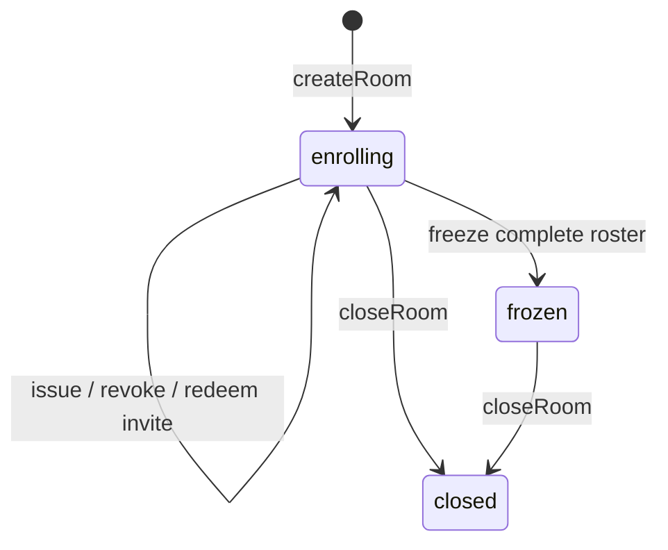

# Rooms, group transitions and coordinator changes

[Architecture overview](../architecture.md)

Rooms solve roster enrollment before ordinary ROAST login. Coordinator rotation
changes an approved transport destination while preserving the group and keys.
Group transitions describe replacing membership and generating successor keys.
These are distinct operations with different implementation maturity.

## Enrollment models

| Model | Fields and meaning |
| --- | --- |
| `RoomInvite` | Protocol version, room/invite IDs, random 32-byte token, expected participant key, pinned coordinator ID, relay/IP hints and expiry |
| `EnrollmentTranscript` | Domain/version, room/invite IDs, token hash, expected participant key, coordinator ID and fresh 32-byte nonce |
| `EnrollmentChallenge` | Transcript plus short expiry |
| `RoomInviteSnapshot` | Expected key, token hash, issue/expiry/use/revocation times and status |
| `RoomParticipantSnapshot` | Identity public key, enrollment time and identifier assigned at freeze |
| `RoomSnapshot` | Lifecycle, capacity, proposed threshold, coordinator ID, invitations, participants and optional frozen group |

The shared definitions are in [`room/`](../packages/noosphere/lib/room).
`RoomInvite.encode` produces a base64url-friendly canonical binary value.
The token is secret; persisted snapshots retain only `SHA256(token)`. A stolen
token alone cannot enroll without the expected participant identity private key.

## Room state machine

[`RoomManager.open`](../packages/noosphere_server/lib/src/room/manager.dart)
requires an explicit `RoomPersistence`. It restores snapshots, verifies each
record's room ID against its storage key, and rejects coordinator IDs that
differ from the active identity. There is no implicit memory store.

Management operations run through a manager-wide FIFO. Creating a room sets
the expected participant count and threshold. Issue rejects duplicate enrolled
keys, duplicate pending invitations and capacity exhaustion. Pending invites
reserve room capacity until used/revoked/expired. These decisions are persisted
before successful results are returned.

Current validation permits room thresholds from 1 through capacity, whereas
`NewDkgDetails` requires at least 2. The room threshold is policy metadata;
freezing only builds `GroupConfig`, which has no threshold field. An importing
application must choose a valid DKG threshold matching its intended room policy.
The ordinary handler does not enforce room metadata as a global key threshold.

## Possession proof

`IrohRoomEnrollmentApi.joinRoom` requests `KeyPurpose.roomEnrollment` and checks
the private key against the invite before opening the connection. The
transport-independent `RoomEnrollmentClient` checks the complete returned
transcript against the invite, then signs it with `Signed<EnrollmentTranscript>`.

The server validates token hash, room state, expected key, capacity and pinned
coordinator. It issues a fresh nonce and short-lived challenge (20 seconds by
default). On redemption it removes the pending challenge **before** validating
the proof. Failed or successful attempts therefore cannot reuse that nonce.

After verifying transcript equality and the identity signature, the manager
consumes the invitation and inserts the participant in one replacement room
snapshot. It awaits durable storage before updating memory and publishing the
public snapshot. Failed writes block further mutations until the manager is
reopened and reloaded.

Challenges are intentionally not durable. A client interrupted during proof
exchange obtains a fresh one; used/revoked invitations remain recorded.

## Enrollment protobuf RPCs

Enrollment uses `noosphere/roast-enrollment/1` on the coordinator's existing
Iroh endpoint. Each operation uses one bidirectional stream with the shared
four-byte **big-endian** length prefix and protobuf `Envelope`. The client
sends one `RpcRequest`, finishes its send side, and reads one `RpcResponse`.
Both adapters enforce the configured envelope-size limit. The server reads
through EOF before dispatching, rejecting truncated or additional frames.

| Request | Fields | Response |
| --- | --- | --- |
| `BeginEnrollmentRequest` | Canonical invite bytes and a 33-byte compressed participant public key | `BeginEnrollmentResponse.challenge`: canonical `EnrollmentChallenge` bytes |
| `RedeemRoomInviteRequest` | Canonical transcript bytes and a 64-byte Schnorr signature | `RedeemRoomInviteResponse.snapshot`: canonical `RoomSnapshot` bytes |

Each RPC has a fresh random 16-byte correlation ID. The client validates the
wire version, matching ID, and expected response variant. Enrollment does not
require a ROAST session ID: the invite and proof authorize the operation.
The invite/transcript retain their canonical domain separator and enrollment
version. Signatures still cover those domain bytes, never a protobuf encoding.

Errors use `ProtocolError`, with an optional `room_failure_code` preserving
the manager's domain error index. Malformed frames, unsupported versions and
size/time limits are rejected before enrollment. There is no automatic retry
of redemption; a lost reply may follow a successful durable write.

The public network protocol exposes begin/redeem only. Creation, invitation
issue/revocation, freezing and closing belong to the host's management surface.
There is no built-in remote administrative authentication/UI for those actions.

## Freezing a group

Once all expected participants are enrolled, `freezeRoom` sorts compressed
identity public keys lexicographically and assigns `Identifier.fromUint16(1)`
through `Identifier.fromUint16(n)`. The canonical `GroupConfig` uses the room ID
and that mapping. Enrollment order does not determine identifiers.

`IrohServer.freezeRoom` persists the frozen room, creates/restores a group
handler and registers it with the ROAST dispatcher on the same endpoint.
Frozen rooms are registered again at server startup. Closing removes future
group routing; it does not destroy already distributed shares or revoke the
cryptographic ability of an old threshold to sign.

The host distributes the frozen configuration and each participant discovers
its identifier by matching its identity public key. Normal authenticated ROAST
login and DKG follow. The enrollment protocol does not automatically perform
DKG or provide a network subscription to every subsequent room change.

Workers can proxy room persistence for embedded servers, but do not yet expose
room management commands or DTOs. Direct server and enrollment APIs remain
usable separately. Room snapshot/rejection streams are local manager streams,
not ROAST network events.

## Coordinator address update versus identity switching

Refreshing `EndpointAddr` hints under the same pin uses
`updateSignerAddress`. Moving the coordinator while retaining its identity
uses identity backup/restore. An actual change to the trusted endpoint ID uses
[`NoosphereWorker.switchCoordinator`](../lib/src/worker.dart), after the
application has approved that ID:

1. Serialize the switch with other setup operations and stop the old signer.
2. Load client storage and reject switching when prepared operations or
   unexpired nonce records remain unresolved.
3. Await the host's durable coordinator-selection callback.
4. Build options with the new address/pin and connect to a server serving the
   same group; expose the replacement through ordinary worker events.

A pending-operation or persistence error leaves the signer stopped. Timeout
does not cancel the host callback; reconcile the stored selection before
starting again. A connection failure after persistence retains the new
configuration for an explicit retry. There is no automatic fallback to the old
pin and no voting/quorum protocol in this helper. Room records and invitations
stay bound to their original coordinator and are not migrated by switching.

This sequence is serialized, not atomic across storage and the network. Success
confirms only the local signer's connection; it does not establish group-wide
approval, switching or signing availability. The application coordinates its
own rollout and recovery using the
[host workflow](../packages/noosphere/spec/COORDINATOR_ROTATION.md#host-workflow).

## Group-transition models implemented today

The shared [`group_transition/`](../packages/noosphere/lib/group_transition)
directory implements canonical proposal and approval values:

| Model | Content |
| --- | --- |
| `GroupTransitionKeyPlan` | Application key ID, old group key, source/target thresholds and exact authorized `NewDkgDetails.sigHash` |
| `GroupTransitionMigrationPolicy` | Host codec kind, positive version and 1–65,535 opaque policy bytes |
| `GroupTransitionProposal` | Domain/version, transition ID, complete source group, distinct successor room ID, pinned coordinator, successor identities, key plans, policy and creation/expiry |
| `GroupTransitionApproval` | Proposal hash, approving identity key and approval time; signed by that identity |

Proposals sort successor public keys and key plans canonically, reject
duplicates and invalid thresholds, and reject noncanonical decoded encodings.
Retained/added/removed participants are compared by public key, not by numeric
FROST identifier. The same participant may receive a new identifier in the
successor group. Existing shares cannot be relabeled into the new roster.

The successor FROST key is absent from the initial proposal because DKG has not
created it yet. The key plan binds the exact permitted DKG details, and host
policy bytes bind the accounts/assets/destinations/fees/retry scope reviewed.
Noosphere does not interpret those opaque application fields.

An individual `GroupTransitionApproval` proves identity-key consent to a
proposal. It is not itself a completed old-group threshold authorization,
proof of successor readiness or evidence of application migration.

## Proposed orchestration, not yet implemented

[`GROUP_TRANSITIONS.md`](../packages/noosphere/spec/GROUP_TRANSITIONS.md)
describes a broader successor workflow: proposed, preparing, ready, migration
pending, active and retired. There is currently no `GroupTransition` engine,
transition RPC family or worker command family implementing it end to end.

Coordinator switching remains a small independent primitive. Any future shared
transition orchestration belongs in a separate layer, with its scope informed
by application integrations. Protocol-level consent checks and authenticated
DKG-result bindings remain Noosphere responsibilities in that design; the
application owns governance and application-specific migration effects.

The intended process creates a fresh successor group/key, obtains bounded
consent, proves its readiness, authorizes migration under the old threshold,
and changes application authority only after host-verified completion.
Authenticated DKG-result evidence binding the transition is still needed;
key-only DKG ACKs do not prove all those bindings.

The host owns trusted identity presentation, durable consent, asset discovery,
transaction construction/submission, fees and external completion evidence.
An old threshold is needed to migrate authority held by the old key. Reusing
identity keys does not reuse FROST private shares, and `shareKeySecret` is not
the membership-change mechanism. Preserving the old FROST public key would
require a separate reviewed resharing/share-epoch protocol.
