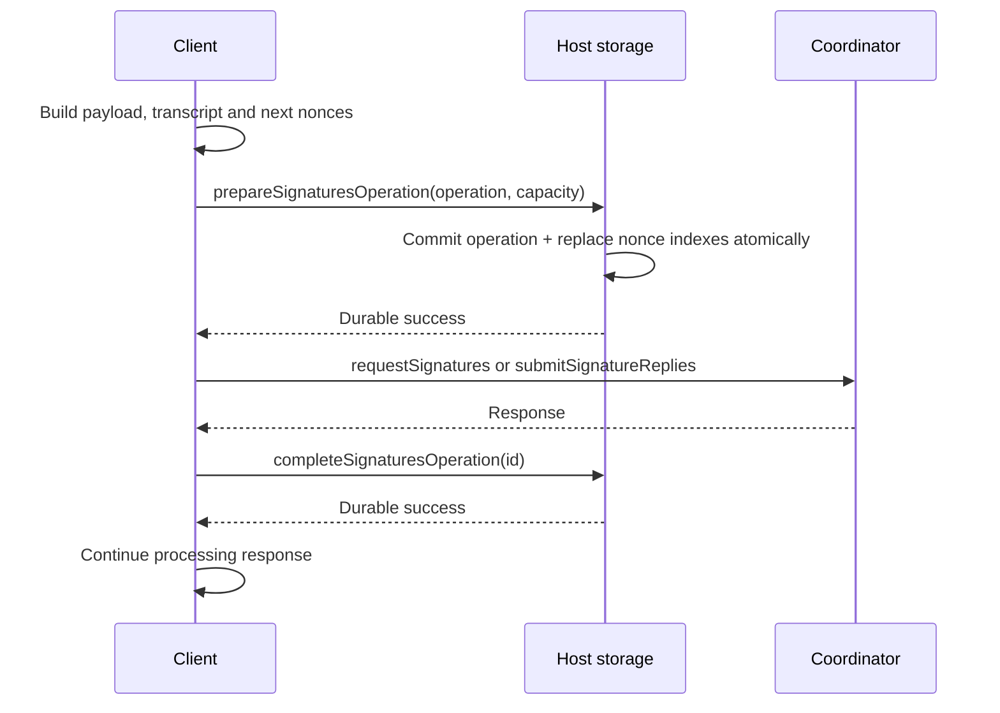

# State and persistence

[Architecture overview](../architecture.md)

Noosphere owns protocol semantics and active state machines. The importing
application owns durable storage and its own application state. The library
does not choose a database, encrypt a database, maintain a wallet's accounts,
or reconstruct a UI from a globally persisted event log.

The distinction is practical: `Client` must remember a pending round while
signing, but its host must atomically store nonce changes; `RoomManager` must
validate invite redemption, but its host must durably commit the resulting
room record. Applications must satisfy these contracts for the protocol's
restart guarantees to hold.

## Ownership map

| State | Library responsibility | Host responsibility |
| --- | --- | --- |
| Sessions, sockets, timers, challenges | Create, validate, expire and dispose | Restart runtime when needed |
| DKG temporary secrets | Keep during the active attempt | Treat interrupted attempts as interrupted |
| FROST key records | Define fields, validate protocol updates | Encrypt and persist records; scope them to the correct participant/group |
| Signing nonces and prepared operations | Define safe transition ordering | Atomic transactions, durability, rollback protection and reconciliation |
| Coordinator attempts/results | Serialize snapshots and restore safe states | Atomic storage per group ID |
| Rooms and used/revoked invitations | Validate and serialize transitions | Atomic records, integrity and cross-process ordering |
| Iroh server identity | Load/create using a provider and enforce byte shape | Secure custody and backup; consistent identity creation |
| Application approvals, history, transactions | Supply proposal/result APIs | Policy, durable consent, UI projection, external effects and deduplication |

Testing entry points expose `InMemoryClientStorage`, `InMemoryServerPersistence`
and `InMemoryRoomPersistence`. They model the interfaces but lose data when
their host dies. Their presence does not supply production durability.

## Client storage contract

[`ClientStorageInterface`](../packages/noosphere_client/lib/src/client/storage_interface.dart)
is a domain-specific contract, not a generic key/value store:

| Method | Required effect |
| --- | --- |
| `loadState()` | Load keys, nonces, prepared operations and rejections from one consistent snapshot |
| `addOrReplaceFrostKey` | Replace by group public key, preserving the complete supplied record |
| `addSignaturesNonces` | Merge/replace included signature indexes without deleting other indexes |
| `prepareSignaturesOperation` | Atomically persist the operation and replace all included nonce indexes |
| `completeSignaturesOperation` | Clear/complete the prepared marker while retaining next nonces |
| `addRejectedSigsRequest` | Persist rejection before its network transmission |
| `removeRejectionOfSigsRequest` | Remove the rejection as part of explicit acceptance |
| `removeSigsRequest` | Remove the request's nonces, prepared operation and rejection |

The provider receives no group ID on each method. A host must bind a provider
to the correct storage namespace rather than accidentally sharing one
participant's records with another setup.

[`ClientCachedStorage`](../packages/noosphere_client/lib/src/client/cached_storage.dart)
loads that snapshot and holds convenient in-memory maps. Normal mutations
await the provider before updating caches. These caches can be rebuilt and
must never be the only copy of security-sensitive records.

## Atomic signing preparation

FROST nonces must not be reused to produce shares for incompatible transcripts.
The participant creates its outgoing commitment/share data and fresh next
nonces, then calls one atomic preparation operation before network I/O:

Implementing preparation as two unrelated database writes breaks this contract.
After a crash, storage must not expose a new operation alongside old consumed
nonces, or expose replaced nonces with no indication of a possibly sent
operation.

If preparation fails, `ClientCachedStorage` conservatively retains an in-memory
prepared marker: the provider might have committed before reporting failure.
No RPC follows that failed preparation. If the network reply or completion
write fails, the durable marker remains. Reconnect reloads storage; an
outstanding prepared request is rejected rather than signed again blindly.

The record stores outgoing payloads for diagnosis/reconciliation, not because
`ReconnectingIrohClient` automatically retransmits them. Request IDs alone do
not provide exactly-once execution.

Verified signature completion waits for `removeSigsRequest` before removing
the request from client state and publishing completion. Applications must
separately persist the signatures and their business meaning; the client store
has no general completed-signature history method.

## Coordinator storage

[`ServerPersistence`](../packages/noosphere_server/lib/src/server/persistence.dart)
has `load(groupId)` and atomic `write(groupId, ServerStateSnapshot)`. The record
is opaque to the host. Its versioned JSON payload contains DKG attempt markers,
signing attempt markers, completed results, and encrypted recovery-share state.

[`ServerApiHandler`](../packages/noosphere_server/lib/src/server/api_handler.dart)
loads storage through `ready`. A new group writes an initial snapshot. Existing
active attempts are converted into safe recovery states and that conversion
is persisted before accepting requests. `state` exposes the last successfully
published snapshot, not an uncommitted mutation of internal maps.

`_prepare` awaits readiness, checks the unknown-write latch, and performs
explicit expiry cleanup. Mutating operations await `_persist` before publishing
their associated durable protocol transition. Sessions/challenges and
rebuildable ACK caches are intentionally ephemeral; persistence is not required
for every presence event or cache update.

A failed server write sets `_writeOutcomeUnknown`. Further prepared operations
fail until a new handler reloads the store. Internal memory may already contain
the attempted mutation, so continuing from that memory would be unsafe.

## Room and identity storage

[`RoomPersistence`](../packages/noosphere_server/lib/src/room/persistence.dart)
loads all room-ID-to-byte-record entries and atomically writes one room.
`RoomManager` persists before replacing its in-memory snapshot and emitting
progress. Invite consumption and participant insertion are one room write.
Any write failure blocks further mutations until the manager is reopened.

[`ServerIdentityStore`](../lib/src/server_identity_store.dart) reads and writes
exactly 32 bytes. `loadOrCreateServerIdentity` shares the in-flight load/create
future for the same provider instance using an `Expando`; generated bytes are
written before the endpoint starts. The identity remains stable across restarts
only if the host preserves those bytes.

Identity export returns a defensive copy of the secret, not an endpoint ID.
Restore runs before the provider has been claimed by a starting node. Replacing
a different identity requires the explicit overwrite option. Provider-instance
caching coordinates one host isolate, not multiple processes.

## Worker proxy ordering and timeout ambiguity

The [worker host setup](../lib/src/worker/worker_host_setup.dart) keeps providers
on the host isolate. Client, room and server storage operations pass through
the setup's shared FIFO. `prepareSignaturesOperation` remains one provider call
across that boundary.

Client, room and server providers also have `Expando<SerialExecutor>` queues keyed by
the concrete provider instance. These survive setup/worker replacement within
the host isolate. A replacement using the same provider waits behind a prior
unfinished operation before loading records.

Hosts using multiple provider instances or processes for the same records must
coordinate that access themselves. No in-memory queue replaces database locking
or transactional isolation. Queued client operations capture their provider
before waiting, so stopping or rebinding a setup cannot redirect an old write.

The host applies `hostOperationTimeout` to waiting for a call. A timeout does
not cancel its underlying transaction. An old write can commit after an error
reply. A replacement must wait for or reconcile such writes before treating a
load as authoritative. A timeout is not evidence that a mutation never happened.

## Recovery behavior

| Record at interruption | Implemented recovery |
| --- | --- |
| Login sessions, challenges, connections, online status | Discard; authenticate again |
| DKG temporary client secrets | Not restored; obtain fresh consent/attempt as appropriate |
| Active coordinator DKG | Restore as interrupted; old round messages cannot resume it |
| Interrupted DKG name | Blocks a different creator until expiry; the original creator may explicitly replace its own attempt |
| Active coordinator signing request | Restore as blocked until expiry; old rounds are not resumed |
| Completed signatures | Restore and include in new login snapshots until expiry |
| Unacknowledged encrypted recovery shares | Restore for recipient delivery |
| Client prepared signing record | Keep request blocked pending a known response/reconciliation |
| Durable client rejection | Re-send when the request appears after login |
| Used/revoked room invitation and frozen roster | Preserve through stored room records |
| DKG ACK cache | Rebuild from participants' stored signed ACKs |

The coordinator's completion ACK set exists in its model but is not populated
by a completed-signature ACK protocol. Applications should expect completion
redelivery and deduplicate durable side effects.

## Application state remains outside the package

Maintain an application model keyed by setup, group, request and application
operation identifiers. Use worker snapshots to refresh current protocol views,
events to update progress, and application storage for history and effects.
Persisting a signature does not submit a transaction; receiving a completion
event does not prove a transaction was confirmed. The library defines neither
of those business transitions.

When deciding whether an operation may resume, use durable records and actual
external outcomes. A UI status, absence of an event, or a discarded `Client`
object cannot establish that a signing mutation was never sent.
